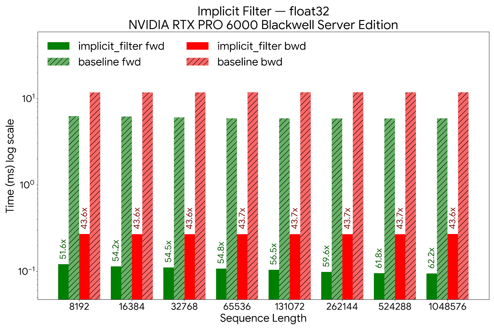
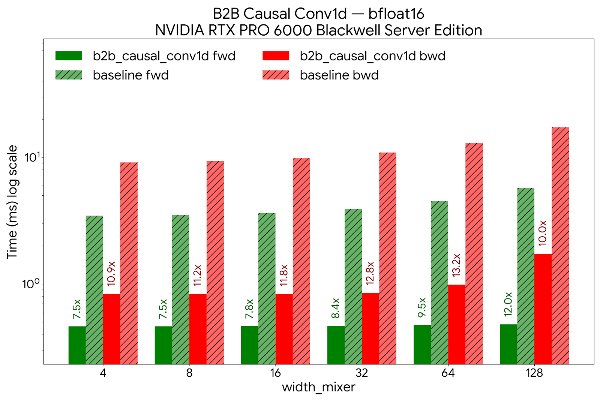
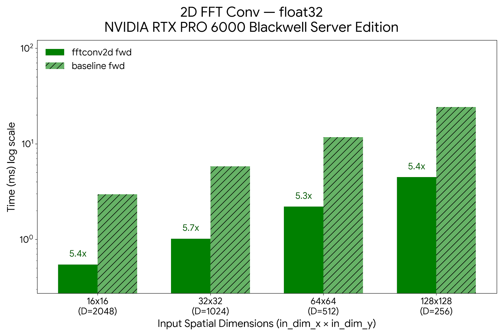

# Benchmarks

Throughput numbers, FLOP scaling, FP16 op-level results, and a worked
ImageNet-training optimization case study.  The raw measurement tables and the
scripts that reproduce them live in the
[`benchmarks/README.md`](https://github.com/NVIDIA-BioNeMo/nvSubquadratic/blob/main/benchmarks/README.md)
single source. When a number changes, update it there and mirror it here.

## FLOP scaling

FLOPs are the hardware-independent floor on cost: before any kernel, cache,
or bandwidth effect, they show why a *global* operator has to be subquadratic
to scale at all.  The plot below sweeps the input resolution of the
ViT-5-Small backbone (7×7 up to 112×112 patches) and counts per-sample FLOPs
for each mixer.

Attention's token-mixing cost grows as $O(L^2)$ in the patch count $L$, so
doubling the grid roughly quadruples its FLOPs; the Hyena variants evaluate
the same global receptive field through FFT convolutions in $O(L \log L)$, so
their curve stays close to linear and the gap widens at every resolution
step.  There is a crossover: at small grids the constant factors dominate and
attention is cheaper, but past a modest resolution the asymptotics take over
and the FLOP gap compounds.  FLOPs are only the theoretical floor, though.  The
sections that follow show how much of that advantage survives as real
wall-clock time, and the kernels that make it survive.

See [`benchmarks/compare_flops.py`](https://github.com/NVIDIA-BioNeMo/nvSubquadratic/blob/main/benchmarks/compare_flops.py)
for the script that produced the plot.

## Throughput scaling

The FLOP advantage above translates into wall-clock time.  This is
forward-pass time versus sequence length for `flash-attention`, the
official `mamba_chunk_scan_combined` Mamba2 kernel, and `nSubQ`:

HyenaND reaches million-token sequences at 265 ms (1M tokens), while attention
takes ~90 s (a **339×** gap) and the Mamba2 kernel runs out of memory.

## CUDA kernels (`nSubQ`)

The throughput curve above is only reachable with kernels that respect the
GPU memory hierarchy.  `nSubQ` is the IO-aware CUDA library behind HyenaND: a
suite of fused FFT-convolution and causal-convolution kernels written with
`CuTe` and `cuFFTDx`, benchmarked here on an NVIDIA RTX PRO 6000 Blackwell
Server Edition.

### Fusion

Two hardware trends shape the design.  GPU matrix-multiply throughput has grown
faster than off-chip (HBM) bandwidth, which favours attention: its dominant
operations ($\mathbf{QK}^\top$ and $\mathbf{PV}$) are GEMMs, and
FlashAttention-style kernels already keep the $L \times L$ score matrix off
HBM.  FFT-based operators have the opposite profile: their fast path is bound
by batched-FFT efficiency, memory layout, and bandwidth rather than
tensor-core GEMM throughput.

A naive FFT convolution is especially HBM-hungry.  A single pass materialises
the padded input, the activation spectrum, the filter spectrum, the
inverse-FFT buffer, and the cropped output (at least five HBM round-trips),
and linear-convolution padding inflates the spatial footprint by roughly
$2^D$ in $D$ dimensions before complex storage is even counted.  That
constant factor can hide the $O(L \log L)$ advantage entirely for 2D images
and 3D volumes.  `nSubQ` closes the gap by fusing the forward FFT, spectral
modulation, inverse FFT, and output segmentation into a single kernel that
keeps every intermediate in on-chip shared memory and registers.

### Measured kernel speedups

All figures are module-level, against the equivalent unfused PyTorch path:

| Kernel                       | What it fuses                              |   Speedup |                Memory |
| ---------------------------- | ------------------------------------------ | --------: | --------------------: |
| Implicit filter generation   | SIREN modal-filter synthesis               |  **>40×** |      **32× less HBM** |
| Causal FFTConv1D (`L ≤ 16K`) | RFFT + spectral product + IRFFT + chunking |   **~6×** |              ~4× less |
| Causal FFTConv1D (`L > 16K`) | 3-kernel Cooley–Tukey (C2C/IC2C + product) |      2–4× |             2–4× less |
| `b2b causal-conv1d`          | proj-conv + gate + mixer-conv + gate       | **>7.5×** | lower HBM, ½ CP comms |
| 2D `fft-conv2d` (forward)    | C2C + complex product + IC2C core          |   **>5×** |          **>2× less** |

The `causal-conv1d` kernels additionally support filters up to 256 taps
(channel-first) / 128 (channel-last), wider than existing optimised packages.

### Implicit filter generation

Profiling the Evo2 long-implicit (LI) layer showed that **30 % of its runtime
was kernel synthesis**, not the convolution itself.  A dedicated fused kernel
accelerates filter generation by over **40×** at the module level and cuts HBM
overhead by **32×** (proportional to the modal-filter order).  The memory this
frees is what lets a 1B-parameter Evo2 model reach 16M-token context.

### 1D long convolutions

For sequence lengths up to 16K, the point where HyenaND's asymptotics
overtake fused SDPA, a single kernel fuses the input and filter RFFTs, the
complex product, the IRFFT, and chunking for a **6×** speedup and **4×** lower
memory.  Beyond 16K a three-kernel Cooley–Tukey decomposition (recasting the
1D FFT as a 2D FFT) holds a 2–4× edge.  For the short projection/mixer
convolutions in the SE and MR layers, the fused `b2b causal-conv1d` kernel
folds projection conv, pre-gate, mixer conv, and post-gate into one
operation: **>7.5×** faster, and with half the context-parallel
communication points.

### 2D FFT convolution

For vision workloads the `fft-conv2d` kernels run an RFFT along the first
axis, a fused C2C-FFT + complex-multiply + inverse-C2C core along the second,
and a closing IRFFT, keeping the frequency-domain intermediates on chip.
Against an unfused baseline this is over **5×** faster with **>2×** lower
memory on the forward pass.

## ViT-5-Small ImageNet training: an optimization case study

ImageNet-1k pretraining is where ViT-5-Small's accuracy is validated before the
architecture is used on downstream work, so we needed to train it, and train it
often.  An 800-epoch run is the unit of experiment, and its wall-clock cost
sets the pace of the research loop: every recipe change, ablation, or
hyperparameter sweep pays that cost again.  When this work began a single run
took roughly **37 hours** on 8 × H100 with the first GPU data pipeline (and
longer still on the original CPU pipeline).  The optimizations documented here
bring a full run down to about **12 hours**.  Faster runs mean more ideas
tested per GPU-week and a lower cost per result, which is why we invested in the
*training and data pipeline* and not only the model.

Training ViT-5-Small on ImageNet (22 M params, 224 × 224, batch 256,
8 × H100 SXM 80 GB, BF16) also makes a clean worked example of systematic
pipeline optimization.  Every distributed vision job is bounded by model
compute, data augmentation, and storage I/O independently, and fixing one
merely exposes the next.  The work below drove end-to-end throughput from
roughly 2.5 it/s to 12.6 it/s (**5×**) by finding and eliminating each
bottleneck in turn.  The sections that follow walk each phase: what the profiler
showed, why the fix worked, and what it exposed next.

Full profiling tables and configuration history live in
[`examples/vit5_imagenet/OPTIMIZATION_TRACKER.md`](../examples/vit5_imagenet/OPTIMIZATION_TRACKER.md).

______________________________________________________________________

### Phase 1: unblock the compiler

The original model could not run `torch.compile(max-autotune)` at all; it
crashed with CUDA Graph errors.  The root cause was a per-forward RoPE cache
built from a Python `dict`, which forced a graph break on every step and
prevented the tracer from ever capturing a static graph.  Replacing it with a
precomputed `register_buffer` fixed the graph break, unlocked `max-autotune`,
and as a side effect also enabled CUDA Graph replay between steps.

Three supporting changes completed the model cleanup:

- SDPA backend selection left to PyTorch, so it auto-picks CuDNN on H100
  instead of being locked to FlashAttention.
- Redundant `.to(bfloat16)` / `.to(in_dtype)` casts around SDPA removed;
  autocast owns precision.
- Manual float32-upcast RMSNorm swapped for QuACK's fused Triton kernel.

None of these changes touch weights or hyperparameters.

*Single-GPU model throughput (synthetic data, no I/O):*

| Configuration                      |  ms/step |     img/s |       MFU |
| ---------------------------------- | -------: | --------: | --------: |
| Eager — original                   |    159.2 |     1,608 |      4.6% |
| `torch.compile` (default)          |     46.0 |     5,560 |     15.9% |
| `torch.compile` (max-autotune)     |  *crash* |         — |         — |
| **After model optimizations**      |          |           |           |
| Eager — optimized                  |    111.1 |     2,305 |      6.6% |
| `torch.compile` (default)          |     33.2 |     7,716 |     22.0% |
| **`torch.compile` (max-autotune)** | **32.0** | **8,003** | **22.9%** |

Theoretical peak on H100 SXM (989 TFLOPS BF16) is ~34,800 img/s (100% MFU).
At 22.9% MFU the remaining gap is compute-bound GEMM and FFT kernel efficiency;
Python and framework overhead are gone.

______________________________________________________________________

### Phase 2: replace the CPU data pipeline

With compute at 32 ms/step, CPU data loading immediately became visible.
Single-GPU profiling showed torchvision CPU decode and augmentation costing
**105 ms/step**, more than three times the compute budget.  Replacing it with
NVIDIA DALI (GPU-pipelined JPEG decode, crop, flip) dropped the data component
to ~42 ms.  The compute side was unchanged; the full step shrank because the
pipeline was no longer stalled on the CPU.

Augmentation transforms were also ported to GPU-friendly forms for
`torch.compile` compatibility: device-cached normalisation tensors via
`register_buffer`, `torch.where`-based blending instead of boolean-index
scatter, vectorised colour jitter via `argsort`.  One attempted optimisation,
DALI `fn.transpose` for CHW output, was **reverted** after profiling showed it
added ~47 ms due to an explicit memory copy.  Layout conversions that look free
in PyTorch carry a real cost inside the DALI pipeline graph.

______________________________________________________________________

### Phase 3: eliminate I/O variance

The jump from v2 (6.3 it/s) to `optimized_plus` (12.1 it/s) is the biggest
single step in the campaign: nearly a **2× gain** from a change that has
nothing to do with the model.  The mechanism is DDP synchronisation stalls
caused by cross-rank I/O variance on a shared network file system.

In DDP, every rank must enter `allreduce` together.  When DALI fetch times vary
from 0.6 ms to 200+ ms across ranks (the norm on a shared NFS under load),
the fast ranks park at the barrier waiting for the slow ones.  Those stalls
appear inflated inside the backward pass in per-phase profiling, making it easy
to misattribute them to compute.  Staging ImageNet on each node's local NVMe
(`/scratch`) gave every rank consistent 1–5 ms fetch times and eliminated the
stalls entirely.

The v2 augmentation changes shaved ~30 ms off per-step time, but were invisible
at DDP scale as long as the I/O stall dominated.  Optimisations that show
clearly in single-GPU profiling may be masked by a different bottleneck in
multi-GPU runs.

*Multi-GPU DDP training throughput (8 × H100, end-to-end):*

| Version                  | Dataloader                     | Storage        |     it/s | ms/step |  Speedup |
| ------------------------ | ------------------------------ | -------------- | -------: | ------: | -------: |
| CPU baseline             | torchvision                    | Network FS     |     ~2.5 |    ~400 |     1.0× |
| v1 (DALI)                | DALI                           | Network FS     |      5.3 |     189 |     2.1× |
| v2 (DALI + compiled aug) | DALI                           | Network FS     |      6.3 |     159 |     2.5× |
| **optimized_plus**       | **DALI + compiled aug**        | **Local NVMe** | **12.1** |  **83** | **4.8×** |
| **fused**                | **DALI (all aug in pipeline)** | **Local NVMe** | **12.6** |  **79** | **5.0×** |

______________________________________________________________________

### Phase 4: fuse augmentations into the DALI pipeline

After NVMe staging, the step breakdown exposed one remaining serial cost: ~25 ms
of GPU augmentation running in `on_before_batch_transfer`, between DALI fetch
and the forward pass, outside the DALI pipeline's internal overlap window.

Moving ThreeAugment, ColorJitter, uint8→float, and normalisation **entirely into
the DALI pipeline** (using `enable_conditionals=True` for the per-sample
branching) reduced that component from ~6 ms (v2 measured) to **0.35 ms**
(Mixup + NHWC permute only).  The "data (ms)" column in the table below goes
*up* slightly because it now includes augmentation; what matters is that the
**full step goes down** because DALI's internal scheduler overlaps augmentation
with I/O and the previous step's compute.

*Fused vs. optimised DALI, DDP × 8, H100 SXM, NVMe:*

| Pipeline       | Model     | Full step (ms) | Agg throughput (img/s) |  Speedup |
| -------------- | --------- | -------------: | ---------------------: | -------: |
| DALI-optimised | Small     |           80.6 |                 25,401 |        — |
| **DALI-fused** | **Small** |       **70.4** |             **29,103** | **+15%** |
| DALI-optimised | Base      |          131.1 |                 15,622 |        — |
| **DALI-fused** | **Base**  |      **120.8** |             **16,950** |  **+9%** |

______________________________________________________________________

### Final state: fully compute-bound

*Step breakdown after all optimisations (fused DALI, NVMe, compiled):*

| Component              | Time (ms) | % of step |
| ---------------------- | --------: | --------: |
| DALI fetch             |        ~2 |        3% |
| Mixup/CutMix + permute |      0.35 |      0.5% |
| Forward + backward     |       ~66 |       94% |
| Optimizer (FusedLAMB)  |        ~2 |        3% |

Data loading (decode, augmentation, I/O, and transfer) now accounts for less
than 4% of wall-clock time.  The pipeline is fully compute-bound.
Further throughput gains require model-level work: DDP allreduce efficiency,
larger batch sizes, or architectural changes to the mixer itself.

## Op-level results

- [FP16 circular FFT convolution](https://github.com/NVIDIA-BioNeMo/nvSubquadratic/blob/main/reports/fp16_fft_convolution/REPORT.md).
  The full investigation report: the dual-mean-centering derivation, the
  accuracy and throughput results against the FP32 reference, and why the
  FP16 path was kept opt-in rather than made the default.
