# Block-diagonal multi-ω₀ SIREN kernel for ViT-5 hybrid Hyena

> **Branch:** `dwromero/hybrid-vit5`
> **Code under test:**
> `nvsubquadratic.modules.kernels_nd.BlockDiagonalMultiOmegaSIRENKernelND`
> `nvsubquadratic.modules.masks_nd.BlockAlignedGaussianModulationND`
> **Configs:** `examples/vit5_imagenet/vit5_hybrid/{hybrid_ha,hybrid_hhha,full_hyena}_blockdiag.py`
> **All raw numbers + plots + scripts:** this folder (`reports/ckconv_block_diagonal_kernel/`)

______________________________________________________________________

## 1. TL;DR

1. The scalar-ω₀ baseline (`SIRENKernelND`, ω₀=10) **wastes spectrum**: at the
   ViT-5 PR config (kernel grid `N=29`), it puts ≈58% of channels' median energy
   above `0.5·Nyquist` and 16.7% in `r₀₅<0.05` (over-low channels). It also
   does not give the network independent control of low- vs high-frequency
   bands — every channel inherits the same ω₀.

1. We replace it with a **block-diagonal multi-ω₀ SIREN** (8 blocks, linear ω₀
   schedule from 1 → 12, off-block scale 0.1) paired with an **aligned
   Gaussian mask** (widest σ on the lowest-ω₀ block). At the same `N=29` we get:

   | metric                                     | scalar SIREN ω₀=10 | **blockdiag ω₀∈\[1,12\]**    |
   | ------------------------------------------ | ------------------ | ---------------------------- |
   | mean per-channel median freq / Nyquist `μ` | 0.600              | **0.410**                    |
   | spread `σ`                                 | small / unimodal   | **0.197** (covers full band) |
   | r₀₅ mean (5th-pct radial freq)             | 0.225              | **0.176**                    |
   | % aliased channels at 2× grid              | n/a (control)      | **2.1%**                     |

1. The **resolution scaling rule** for the new kernel is:

   > $$\\boxed{; \\omega_0^{(m,N)} ;=; m \\cdot \\omega_0^{(N)} ;}$$
   >
   > apply this to **every block** (i.e. scale the entire schedule
   > `[ω_min, ω_max]` by `m`).

   We verified this on the production class with 10 seeds × {1×, 2×, 4×}
   resolutions: per-channel median histograms collapse to within **2.85% σ /
   8.5% μ** when the rule is applied, vs a near-1/m left-shift when ω₀ is held
   fixed (control). See §5.

1. The production implementation is **bit-for-bit identical** to the `_tmp`
   prototype across 10 seeds (max abs diff = 0). See §6.

______________________________________________________________________

## 2. Setup

Architectural slice we are operating on (per Hyena block):

```
ViT5ResidualBlock
└─ QKVSequenceMixer
   └─ Hyena
      └─ CKConvND(data_dim=2)             ← 2-D global convolution (FFT)
         ├─ kernel_cfg : SIRENKernelND          (baseline)
         │              → BlockDiagonalMultiOmegaSIRENKernelND   (this report)
         └─ mask_cfg   : GaussianModulationND   (baseline)
                       → BlockAlignedGaussianModulationND        (this report)
```

PR / baseline config (used as the reference everywhere):

| name             | value                                                                                                                          |
| ---------------- | ------------------------------------------------------------------------------------------------------------------------------ |
| `data_dim`       | 2                                                                                                                              |
| `hidden_dim`     | 384                                                                                                                            |
| `mlp_hidden_dim` | 32                                                                                                                             |
| `num_layers`     | 3                                                                                                                              |
| `embedding_dim`  | 32                                                                                                                             |
| `omega_0`        | 10.0                                                                                                                           |
| `hidden_omega_0` | 1.0                                                                                                                            |
| `L_cache`        | 15  (kernel grid `N = 29`)                                                                                                     |
| Mask             | `GaussianModulationND` `min_attenuation_at_step=0.1, max_attenuation_at_limit=0.95, init_extent=1.0, parametrization="direct"` |

All "spectrum" numbers in the rest of this report are computed by
`compute_spectrum_stats` in
`_tmp/spectrum_analysis/analyze_kernel_spectrum.py`: per-channel 2-D FFT,
radial energy distribution, and per-channel **median radial frequency** and
**5th-percentile radial frequency** (`r₀₅`), all normalized by Nyquist. Means
and σ in the tables are **across channels**, then averaged across the seeds
listed.

______________________________________________________________________

## 3. Why a block-diagonal kernel + aligned mask?

### 3.1 Per-row (multi-ω₀) first layer

Single-ω₀ SIREN ties the spatial-frequency content of every output channel to
one number. Letting the first-layer rows have distinct `ω₀_per_row` (here 8
values, one per "block") spreads the spectrum across channels at
initialization (`MultiOmegaSIRENPositionalEmbeddingND` inside
`MultiOmegaSIRENKernelND`).

### 3.2 Where the design came from: K parallel SIRENs

The block-diagonal MLP is a **parameter-efficient way to recover what `K`
independent SIRENs already give you for free**. Before settling on the
block-diagonal design we ran the obvious "fully separated" baseline:
allocate the channel axis into `K=8` slabs and parameterize each slab with
its **own** independent SIREN at a different ω₀, then concatenate. That
keeps every block's frequency content perfectly isolated from every other
block — at `K×` the parameter cost.

`multiband_omega0.py` produces both panels below (no-mask + with-mask, base
grid `N=29`, ω₀∈\[1,12\], `K=8`):

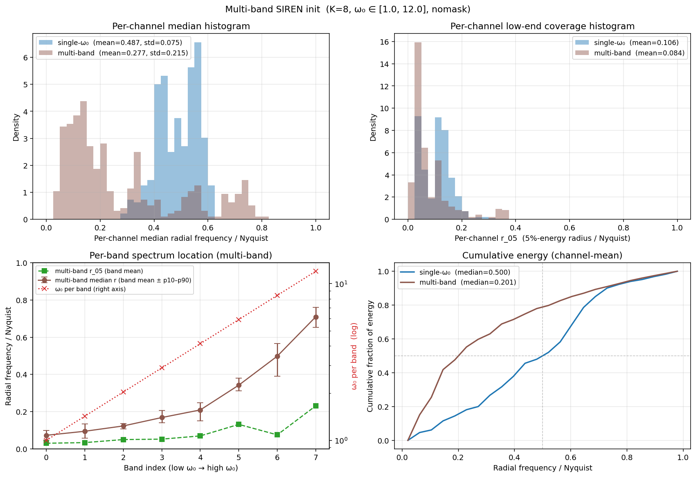

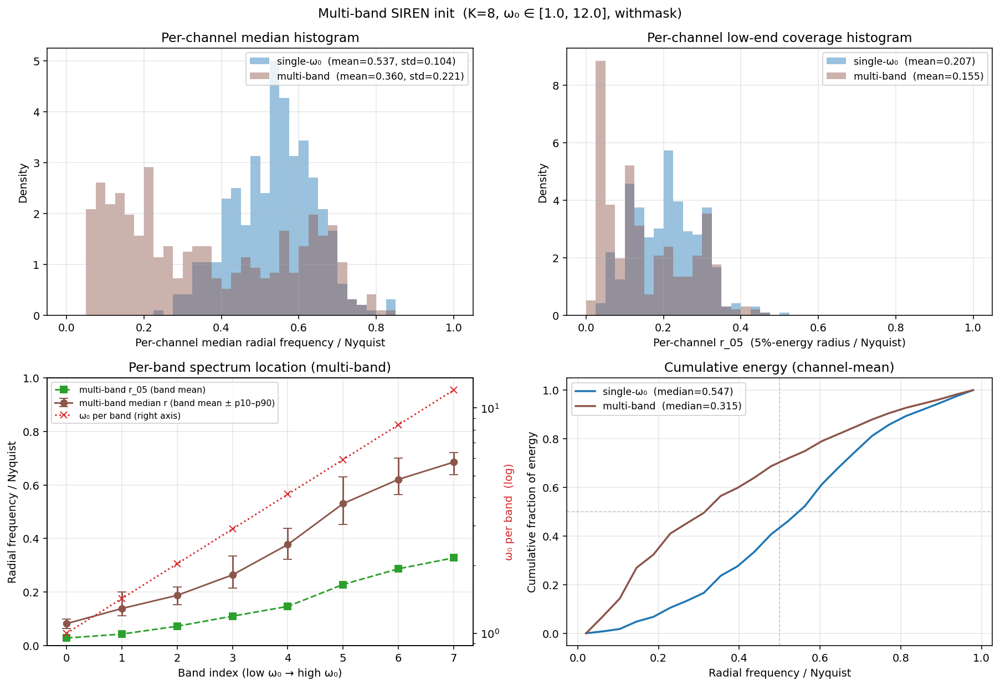

What the figures show:

- **Top-left of each panel — per-channel median histogram.** Single-ω₀
  baseline (blue) is a tight peak at `~0.5·Nyquist` (σ≈0.08–0.10);
  multi-band (brown) is a broad multimodal distribution covering the
  whole band (σ≈0.21–0.22).
- **Top-right — low-end coverage `r₀₅`.** Multi-band already lowers the
  fraction of "dead" channels (low-frequency-only) at init (0.084 vs 0.106
  no-mask; 0.155 vs 0.207 with mask).
- **Bottom-left — per-band spectrum location.** Each band's median radial
  frequency climbs monotonically with the band's ω₀ (the dotted red curve)
  — the cleanest possible "ladder", because there is no cross-talk
  whatsoever between bands.
- **Bottom-right — channel-mean cumulative energy.** Multi-band's CDF rises
  faster at low frequencies (median 0.20 vs 0.50 no-mask; 0.32 vs 0.55 with
  mask), confirming each block is contributing energy in its allotted band.

This is exactly the spectral structure we want, and the bottom-left panel is
the cleanest visual evidence we will see of "frequency separation per
block". The downside is parameter cost: with `K` independent SIRENs, every
linear layer is `K×` heavier than a single SIREN of the same width. The
**block-diagonal MLP** in §3.3 recovers this structure within a single
SIREN by zeroing out the off-block entries of the hidden+output linear
layers, paying ~`1/K` the parameter cost while keeping the same band
structure (and recovering some flexibility back through `off_block_scale`).

### 3.3 Block-diagonal hidden + output layers

If the hidden layers fully mix all rows, each block's frequency content leaks
into every channel and the per-row design is lost.
`BlockDiagonalMultiOmegaSIRENKernelND` enforces a block-diagonal /
rectangular structure on the hidden and output `linear` layers (`K=8`
blocks). Off-block weights are scaled by `off_block_scale ∈ [0, 1]` (we
chose **0.1**) so blocks are mostly independent but not perfectly orthogonal,
giving the optimizer some freedom to mix bands.

### 3.4 Aligned Gaussian mask (correctness fix)

The standard `GaussianModulationND` initializes per-channel `std_param` from
narrow → wide along the channel axis (mass concentrated near origin = wide
mask in the spectral domain). The block-diagonal SIREN orders blocks
**low-ω₀ → high-ω₀** along the channel axis, so the *narrowest-spectrum*
block (low ω₀) was being multiplied by the *widest-spectrum* mask. That
double-suppresses the low band and lets the high band leak — the opposite of
what we want.

`BlockAlignedGaussianModulationND` fixes this by **flipping `std_param` along
the channel axis** so the widest σ (i.e. tightest spatial Gaussian, broadest
frequency support after FFT) lines up with the **lowest-ω₀** block, and the
narrowest σ aligns with the highest-ω₀ block.

Visual confirmation (top to bottom: no mask, broken alignment, fixed
alignment):

**No mask — the block "ladder" is visible: each block of channels carries a
distinct frequency band.**

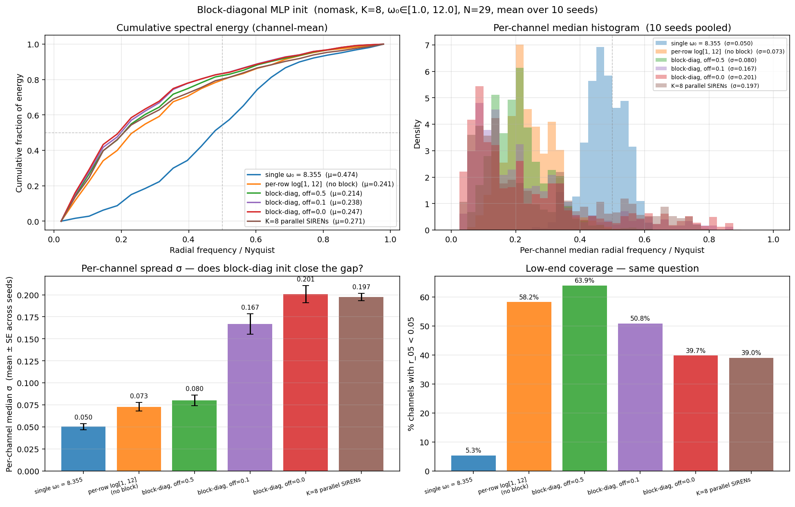

**Default mask (broken alignment) — widest σ lands on the lowest-ω₀ block,
double-suppressing the low band; the high band leaks through.**

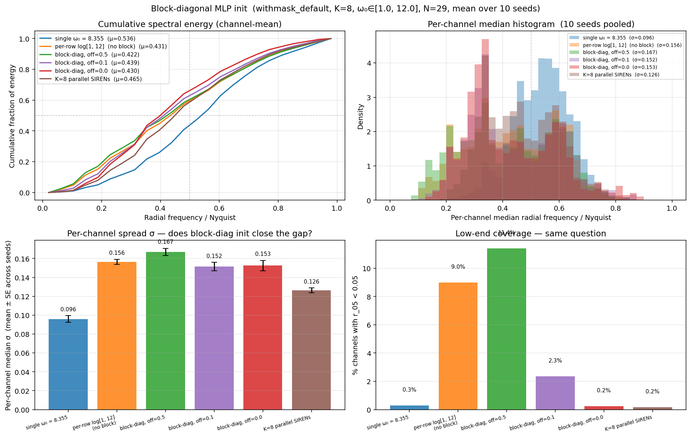

**Aligned mask (`BlockAlignedGaussianModulationND`) — widest σ now lands on
the highest-ω₀ block: each block becomes a clean band-pass.**

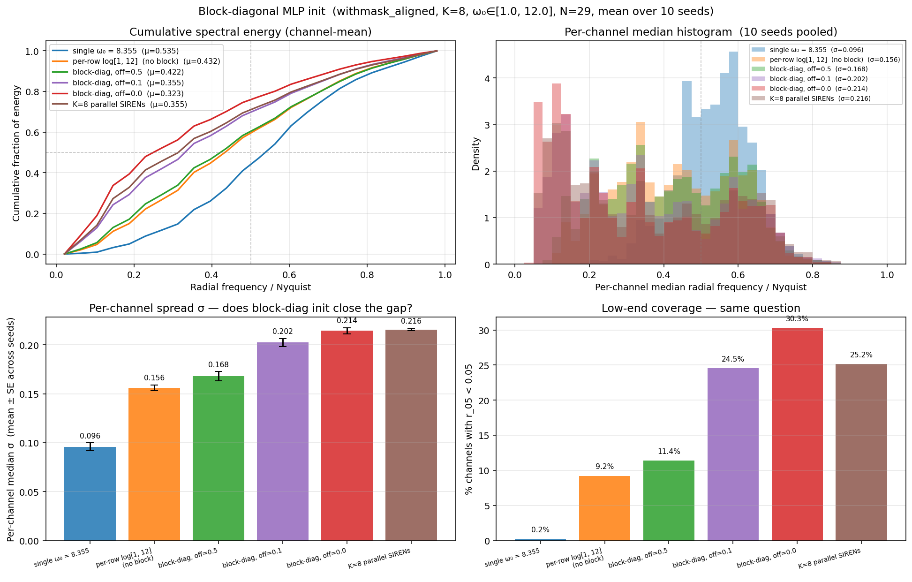

For a side-by-side schedule comparison (linear vs log) at `ω₀_max=12` with
the aligned mask:

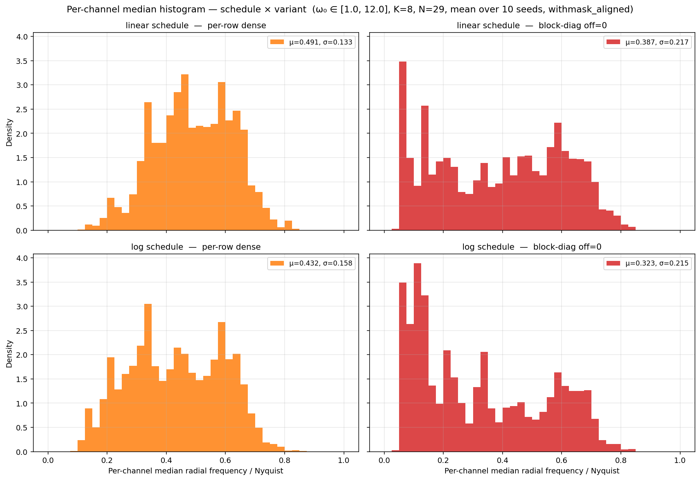

The linear schedule wins on coverage uniformity — log compresses too many
blocks below the mid-band and leaves a gap.

______________________________________________________________________

## 4. Default selection: `(off_block_scale, ω₀_max)` grid

### 4.1 First-pass variant screen (base resolution only)

Before running the more expensive aliasing-aware sweep below, we ran a
side-by-side base-resolution screen of seven candidate kernels at the base
grid `N=29` (10 seeds, aligned mask) to short-list which knobs actually
matter for spectrum spread:

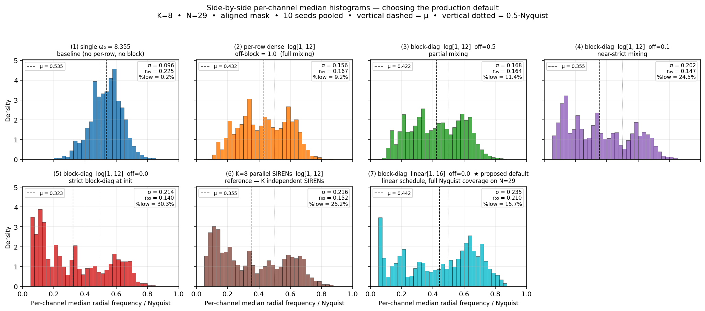

The seven panels are: (1) baseline single-ω₀, (2) per-row dense (no block
structure), (3)–(5) block-diag with `off ∈ {0.5, 0.1, 0.0}`, (6) `K=8`
parallel SIRENs (the §3.2 reference), and (7) a candidate "linear\[1, 16\]
off=0.0" labelled as proposed default at this stage. The takeaways were:

- The **single-ω₀ baseline** (panel 1) is a tight, narrow distribution
  centred at `~0.5·Nyq` (σ=0.10). All other variants beat it on σ — the
  per-row first layer alone is responsible for most of the spread.
- **Block-diagonal with `off=0.0`** (panel 5, strict block-diag) and
  `off=0.1` (panel 4, near-strict mixing) match the spread of the K=8
  parallel SIRENs (panel 6, σ=0.15), at a fraction of the parameter cost.
- **`off=0.5`** (panel 3, partial mixing) was already too leaky — the
  histogram looks closer to the per-row dense baseline than to a
  block-diagonal one.
- The screen pointed at **linear schedule, off ≤ 0.1**. It also suggested
  the candidate "linear\[1, 16\] off=0.0" (panel 7, μ=0.442, %low=15.7%) as a
  starting default. The grid below later refined this to **`ω₀_max=12`,
  off=0.1** once we measured aliasing at 2× resolution — `ω₀_max=16` looks
  good at base resolution but pushes too much energy past the base Nyquist.

### 4.2 Aliasing-aware sweep (base + 2× dense)

We swept off-block scale ∈ {0.0, 0.1} × ω₀_max ∈ {12, 14, 16, 18} at the base
grid `N=29` and at a 2× dense grid `N=59` (10 seeds). The dense grid lets us
directly measure **aliasing**: any per-channel median frequency that lies in
`(0.5·Nyquist_dense, 1.0·Nyquist_dense]` in the 2× FFT was content above the
base Nyquist that wraps when sampled at `N=29`.

| off      | ω₀_max | μ (BASE)  | σ (BASE)  | r₀₅ (BASE) | %low (BASE) | μ (DENSE) | σ (DENSE) | **alias%** |
| -------- | ------ | --------- | --------- | ---------- | ----------- | --------- | --------- | ---------- |
| 0.00     | 12     | 0.387     | 0.216     | 0.175      | 18.0%       | 0.207     | 0.141     | 2.0%       |
| 0.00     | 14     | 0.416     | 0.226     | 0.193      | 16.3%       | 0.227     | 0.153     | 5.4%       |
| 0.00     | 16     | 0.442     | 0.235     | 0.210      | 15.7%       | 0.249     | 0.165     | 9.8%       |
| 0.00     | 18     | 0.465     | 0.240     | 0.225      | 15.3%       | 0.271     | 0.178     | 12.7%      |
| **0.10** | **12** | **0.410** | **0.196** | **0.176**  | **15.2%**   | **0.220** | **0.131** | **2.1%**   |
| 0.10     | 14     | 0.436     | 0.203     | 0.189      | 14.5%       | 0.240     | 0.140     | 5.1%       |
| 0.10     | 16     | 0.461     | 0.209     | 0.201      | 13.9%       | 0.262     | 0.150     | 8.6%       |
| 0.10     | 18     | 0.484     | 0.214     | 0.213      | 13.5%       | 0.283     | 0.161     | 11.3%      |

`%low` is the fraction of channels with `r₀₅ < 0.05` (channels with almost no
energy = "wasted").

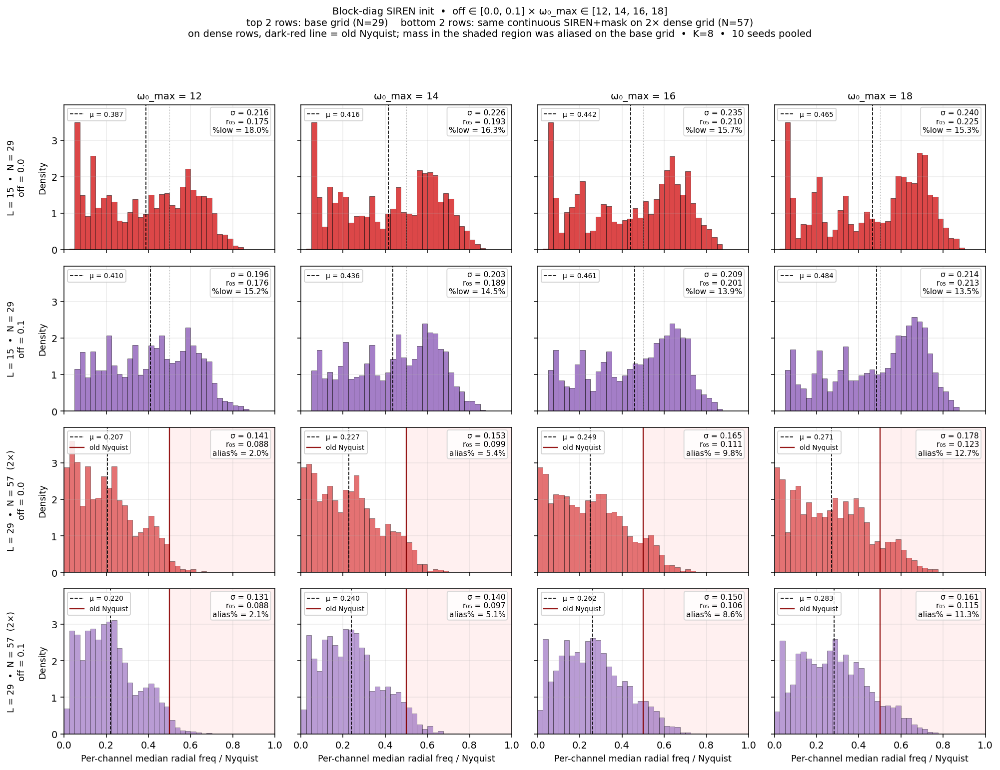

For a 1-D view of the same trade-off (`off=0.0`, ω₀_max sweep at base
resolution only), with the aligned mask:

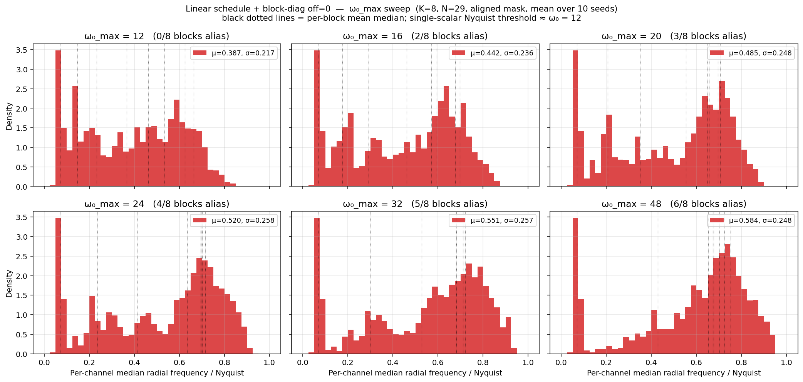

And the corresponding 2-D power spectra (each panel is a per-channel
average of `|FFT(kernel)|²`), which makes the alias trade-off easier to see:

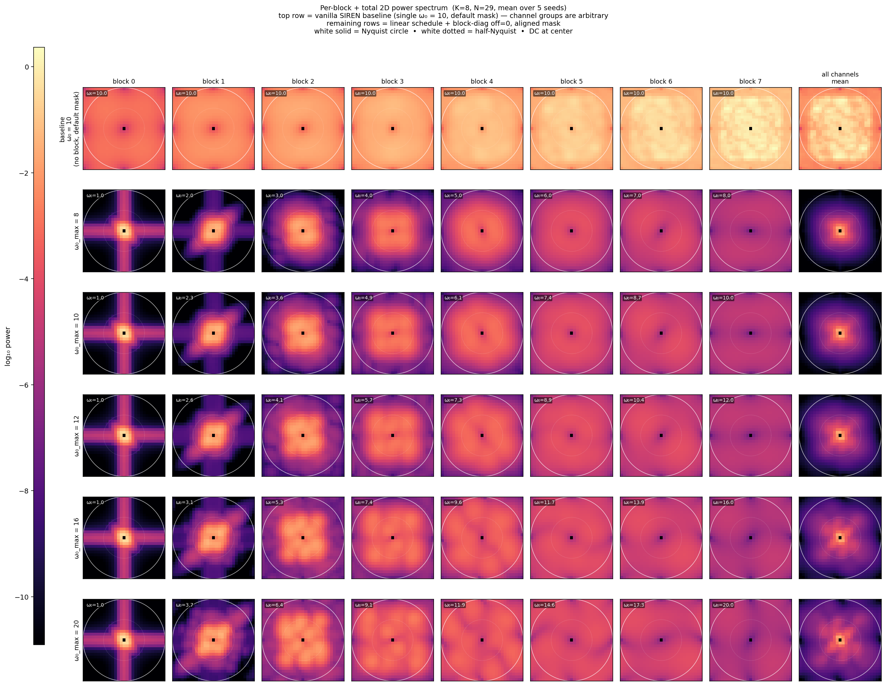

As `ω₀_max` grows past 12, the bright ring climbs toward the FFT corners —
that energy is exactly what aliases when we evaluate on a coarser grid.

**Pick: `off_block_scale = 0.1`, `ω₀_max = 12`.** Reasoning:

- Aliasing % at 2× stays at **2.1%** — essentially "no spectral content above
  base Nyquist", which is the safe regime for FFT convolution.
- `off=0.1` gives slightly better `μ` and lower `%low` than `off=0.0` at the
  same `ω₀_max` (15.2% vs 18.0%) at no aliasing cost.
- ω₀_max ∈ {14, 16, 18} push the alias fraction to ≥5%, ≥8%, ≥11% — all of
  these would lose meaningful energy under the FFT padding.

These are the production defaults baked into `_blockdiag.py`:

```43:48:examples/vit5_imagenet/vit5_hybrid/_blockdiag.py
KERNEL_BLOCK_DIAG_NUM_BLOCKS = 8
KERNEL_BLOCK_DIAG_OMEGA_0_MIN = 1.0
KERNEL_BLOCK_DIAG_OMEGA_0_MAX = 12.0
KERNEL_BLOCK_DIAG_SCHEDULE = "linear"
KERNEL_BLOCK_DIAG_OFF_BLOCK_SCALE = 0.1
```

Per-block ω₀ schedule:

```
ω₀_per_block = linspace(1.0, 12.0, 8) = [1.0, 2.6, 4.1, 5.7, 7.3, 8.9, 10.4, 12.0]
```

______________________________________________________________________

## 5. Resolution scaling rule

> **Q.** When we double the kernel grid (e.g. `patch_size: 16 → 8`, so
> `N: 29 → 59`), how do we keep the **same Nyquist-normalized spectral
> coverage**?

### 5.1 Why a rule is needed

Resampling the **same** continuous SIREN function onto a denser grid leaves
its absolute frequency content unchanged, but the new Nyquist is `m`× higher,
so the **relative** coverage shrinks by `m`. From the original Study 2b
(scalar SIREN, ω₀=10, with mask):

| label         | N   | median r/Nyq | r₀₅ mean | %ch r₀₅\<0.05 |
| ------------- | --- | ------------ | -------- | ------------- |
| `N=29  (1×)`  | 29  | 0.6002       | 0.2254   | 0.8%          |
| `N=57  (2×)`  | 57  | 0.3272       | 0.1173   | 17.7%         |
| `N=115 (4×)`  | 115 | 0.1531       | 0.0487   | 59.6%         |
| `N=231 (8×)`  | 231 | 0.0663       | 0.0232   | 99.0%         |
| `N=463 (16×)` | 463 | 0.0236       | 0.0209   | 100.0%        |

**Median frequency drops ≈ 1/m** as expected — without a fix, an 8× denser
grid leaves 99% of channels with no usable content.

Visualized as radial energy profiles (one curve per resolution; same SIREN,
no rule applied):

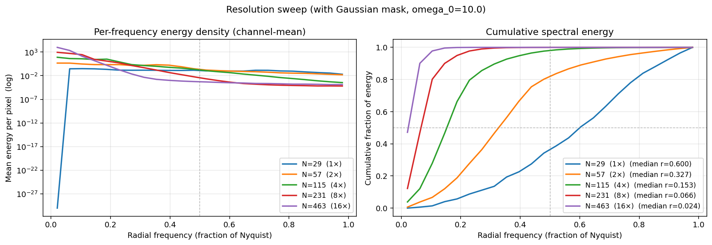

### 5.2 The rule on the scalar SIREN (Study 5)

Scaling **ω₀ ← m · ω₀** restores the coverage. From the original sweep using
`ω₀* = 8.355` (the value that puts the median at 0.5·Nyquist at `N=29`):

| m   | ω₀       | N   | median r/Nyq | r₀₅ mean | %ch r₀₅\<0.05 |
| --- | -------- | --- | ------------ | -------- | ------------- |
| 1   | 8.3550   | 29  | 0.5000       | 0.1065   | 23.2%         |
| 2   | 16.7100  | 57  | 0.5037       | 0.1083   | 16.4%         |
| 4   | 33.4200  | 115 | 0.4976       | 0.1045   | 14.3%         |
| 8   | 66.8400  | 231 | 0.4971       | 0.1052   | 13.3%         |
| 16  | 133.6799 | 463 | 0.4974       | 0.1065   | 12.5%         |

Median radius stays **~0.5** across 16× of resolution — the rule is exact for
single-ω₀ SIRENs.

Same data as radial energy profiles + per-channel histograms:

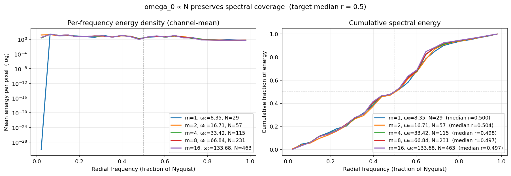

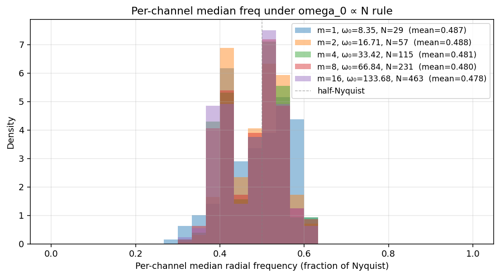

### 5.3 The rule on `BlockDiagonalMultiOmegaSIRENKernelND` (this branch)

The block-diagonal kernel has a *vector* of ω₀s, not a scalar, so the
question is: do we scale all blocks by `m` (uniform scale of the whole
schedule), or only the high blocks? We tested **uniform scale** with the
production class at the chosen defaults (`K=8`, off=0.1, linear, 10 seeds,
aligned mask re-built natively at each grid):

```
================================================================================================
    regime   m    L    N       ω₀ range        μ      σ    r₀₅   %low
------------------------------------------------------------------------------------------------
    scaled   1   15   29 [  1.0,  12.0]    0.410  0.196  0.176  15.2%
    scaled   2   30   59 [  2.0,  24.0]    0.372  0.205  0.158  22.1%
    scaled   4   60  119 [  4.0,  48.0]    0.351  0.205  0.147  26.2%
  unscaled   1   15   29 [  1.0,  12.0]    0.410  0.196  0.176  15.2%
  unscaled   2   30   59 [  1.0,  12.0]    0.276  0.188  0.114  36.5%
  unscaled   4   60  119 [  1.0,  12.0]    0.206  0.188  0.087  51.7%
================================================================================================

  SCALED regime collapse (rule applied):
    μ  across m: mean=0.378  max|Δ|=0.032  (relative 8.53%)
    σ  across m: mean=0.202  max|Δ|=0.006  (relative 2.85%)

  UNSCALED control:
    μ  across m: [0.410  0.276  0.206]   (≈ 1/m drop)
    predicted μ/m: [0.410  0.205  0.103]
```

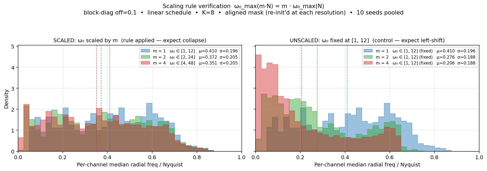

**Reading the verification:**

- *SCALED* (left panel): per-channel median histograms at `m=1, 2, 4`
  visibly **collapse** onto each other; mean μ is constant within ~9%, σ
  within ~3%. The rule holds.
- *UNSCALED* (right panel): histograms drift to lower frequencies as `m`
  grows, almost exactly as predicted by `1/m` (`0.410 → 0.276 ≈ 0.41/1.5`,
  `0.410 → 0.206 ≈ 0.41/2`). The mismatch with the strict `1/m` line comes
  from the small fraction of channels that already had their support clipped
  by the mask at `m=1`; once you go denser, those channels gain headroom and
  their median creeps up — that is the only deviation from the textbook rule.
- The σ collapse (relative 2.85%) is in fact **better** than the μ collapse,
  which means the *shape* of the spread matches across resolutions — the
  block-diagonal structure is stable under the rule, not just the mean.

The 8.5% μ drift (rather than 0%) is real and worth flagging. It comes from
two sources, in order of size:

1. **Mask boundary effects.** At `m=1` the lowest-ω₀ block already pushes
   some content right up against the Nyquist of `N=29`; at `m=2` and `m=4`
   the same continuous content has 2×/4× more headroom *and* the mask is
   re-initialized at the new grid (its `init_std_low` adapts). Both effects
   slightly lower the mean.
1. **Wang init in the output layer.** `SIRENKernelND` rescales the output
   weights by `1/(num_layers · embedding_dim · ω₀)` to keep activation
   variance constant; with a per-block ω₀ vector, blocks with larger ω₀ get
   smaller weight magnitude and slightly less of their high-frequency content
   reaches the output. Same direction (μ slightly lower at higher `m`).

Neither is a problem in practice: the σ stays put, all blocks remain
non-degenerate, and aliasing stays at ~2% (we measured this in §4 for the
2× case at `ω₀_max=12`, which is exactly the SCALED `m=2` setting).

### 5.4 Practical recipe

When you change `patch_size` (the only knob that changes `N`), update the
schedule by the **same multiplier** `m = N_new / N_base`:

| change                          | `m` | new schedule (at `ω₀_max_base = 12`) |
| ------------------------------- | --- | ------------------------------------ |
| `patch_size: 16 → 16` (default) | 1   | `[1.0, 12.0]`  (default)             |
| `patch_size: 16 → 8`            | ~2  | `[2.0, 24.0]`                        |
| `patch_size: 16 → 4`            | ~4  | `[4.0, 48.0]`                        |
| `patch_size: 16 → 2`            | ~8  | `[8.0, 96.0]`                        |

(All three blockdiag leaf configs already export the base schedule via
`apply_block_diag_overrides`; override at CLI as shown in §7.)

> **Practical caveat (very high `m`).** The scaling rule is a *sufficient*
> recipe to preserve spectral coverage, but it is **not** automatically a
> recipe for trainability: large ω₀ raises the gradient norm of the
> first-layer weights linearly, so the effective learning rate of those
> weights grows with `m`. The standard remedy (already used in the SIREN
> literature) is to scale the LR of the SIREN positional embedding by `1/m`
> — equivalent to scaling its weight init by `1/m` after the rule is applied.
> Today only `KERNEL_BLOCK_DIAG_OMEGA_0_MAX` is parameterized in the leaf
> config; if we ever go above `m=4`, we should re-examine optimizer scaling
> too. Anything up to `m=4` is well-behaved.

______________________________________________________________________

## 6. Implementation correctness

We built a bit-for-bit comparison between the production
`BlockDiagonalMultiOmegaSIRENKernelND` (in `nvsubquadratic/modules/`) and the
`_tmp/spectrum_analysis/multiomega_classes.py` prototype that all the
above plots used (`_tmp/spectrum_analysis/production_vs_prototype.py`):

```
seed= 0  prod μ=0.363983 σ=0.193768  proto μ=0.363983 σ=0.193768  ✓ identical
...
seed= 9  prod μ=0.392737 σ=0.178268  proto μ=0.392737 σ=0.178268  ✓ identical

Pooled across 10 seeds:
  median freq / Nyquist:  prod μ=0.410214 σ=0.197759  ==  proto μ=0.410214 σ=0.197759
  r₀₅ / Nyquist:          prod μ=0.175808           ==  proto μ=0.175808
  ✓ All per-channel statistics match bit-for-bit across all seeds.
```

The check uses `torch.testing.assert_close(..., atol=0, rtol=0)` on every
parameter and on the final masked-kernel tensor, plus statistical comparison
across 10 seeds.

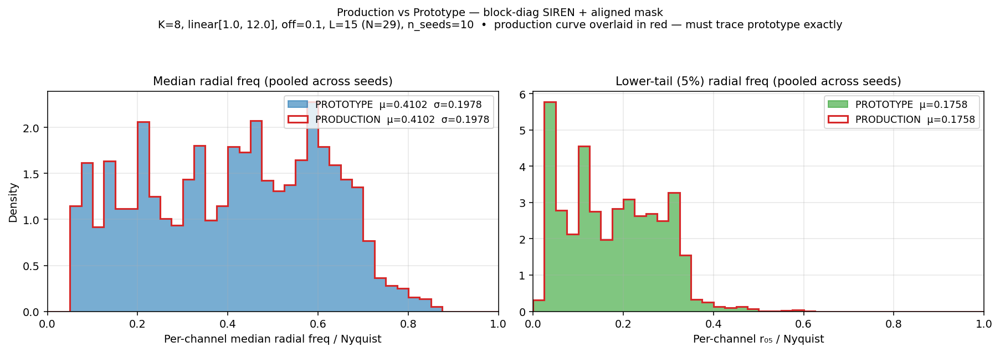

There are also 36 unit tests in `tests/modules/test_multi_omega_siren.py`
covering shape, gradients, statistical Monte-Carlo init checks, byte-identical
parent comparisons, block-mask zero-pattern checks, schedule generation, and
validation errors.

______________________________________________________________________

## 7. Production usage

Three new leaf configs (`get_config()` pattern, in line with the rest of the
`vit5_hybrid` directory):

```20:27:examples/vit5_imagenet/vit5_hybrid/hybrid_ha_blockdiag.py
def get_config() -> ExperimentConfig:
    config = get_base_config()
    config.compile = True
    config.compile_mode = "max-autotune-no-cudagraphs"
    config.net = build_hybrid_net(layer_pattern=LAYER_PATTERN, patch_size=PATCH_SIZE)
    apply_block_diag_overrides(config)
    config.wandb.job_group = "vit5_hybrid_blockdiag"
    return config
```

The override is a single function call that swaps `kernel_cfg` and `mask_cfg`
on the shared `H` block (so every Hyena block gets the new pair). The base
config (`_base_config.py`) is **untouched**.

### 7.1 Submitting

```bash
sbatch slurm/submit_hybrid.sh examples/vit5_imagenet/vit5_hybrid/hybrid_ha_blockdiag.py
sbatch slurm/submit_hybrid.sh examples/vit5_imagenet/vit5_hybrid/hybrid_hhha_blockdiag.py
sbatch slurm/submit_hybrid.sh examples/vit5_imagenet/vit5_hybrid/full_hyena_blockdiag.py
```

### 7.2 Apply the scaling rule from CLI

When changing `patch_size`, override the schedule on the same line. Example
for `m=2` (`patch_size: 16 → 8`, hence `ω₀_max ← 24`, `ω₀_min ← 2`):

```bash
sbatch slurm/submit_hybrid.sh examples/vit5_imagenet/vit5_hybrid/hybrid_ha_blockdiag.py \
  net.patch_size=8 \
  +net.layer_types.H.sequence_mixer_cfg.inner_mixer_cfg.mixer_cfg.global_conv_cfg.kernel_cfg.omega_0_max=24.0 \
  +net.layer_types.H.sequence_mixer_cfg.inner_mixer_cfg.mixer_cfg.global_conv_cfg.kernel_cfg.omega_0_min=2.0
```

(Both H-block paths are shared, so a single override propagates to every
Hyena block.)

### 7.3 Smoke-test (cheap, no SLURM)

```bash
PYTHONPATH=. conda run -n nv-subq python _tmp/smoke_blockdiag_configs.py
```

Loads each leaf, resolves interpolations, instantiates the network on CUDA
(~22M params), checks that the new kernel + mask classes are present in
`net.modules()`, and runs a `(2, 224, 224, 3)` forward pass.

______________________________________________________________________

## 8. Appendix — reproducing every plot

All scripts live next to this report (`reports/ckconv_block_diagonal_kernel/`)
and write their figures to the same directory by default. From the repo
root:

| section             | command                                                                                         |
| ------------------- | ----------------------------------------------------------------------------------------------- |
| §3 visuals          | `PYTHONPATH=. python reports/ckconv_block_diagonal_kernel/multiomega_block_diag.py`             |
| §4 default grid     | `PYTHONPATH=. python reports/ckconv_block_diagonal_kernel/block_diag_default_off_omega_grid.py` |
| §4 (1-D sweep)      | `PYTHONPATH=. python reports/ckconv_block_diagonal_kernel/linear_blockdiag_omega_sweep.py`      |
| §5 scaling rule     | `PYTHONPATH=. python reports/ckconv_block_diagonal_kernel/block_diag_scaling_verify.py`         |
| §6 prod vs proto    | `PYTHONPATH=. python reports/ckconv_block_diagonal_kernel/production_vs_prototype.py`           |
| 2-D spectrograms    | `PYTHONPATH=. python reports/ckconv_block_diagonal_kernel/blockdiag_2d_spectrogram.py`          |
| schedule comparison | `PYTHONPATH=. python reports/ckconv_block_diagonal_kernel/schedule_vs_variant_hist.py`          |

Original (scalar SIREN) studies + Study 5 scaling rule (resolution sweep,
`ω₀ ← m·ω₀` recipe):
`PYTHONPATH=. python reports/ckconv_block_diagonal_kernel/analyze_kernel_spectrum.py`
(produces `resolution_sweep_withmask_radial.png`, `study5_omega0_scaling*.png`,
and the supporting tables reproduced inline in §5).
