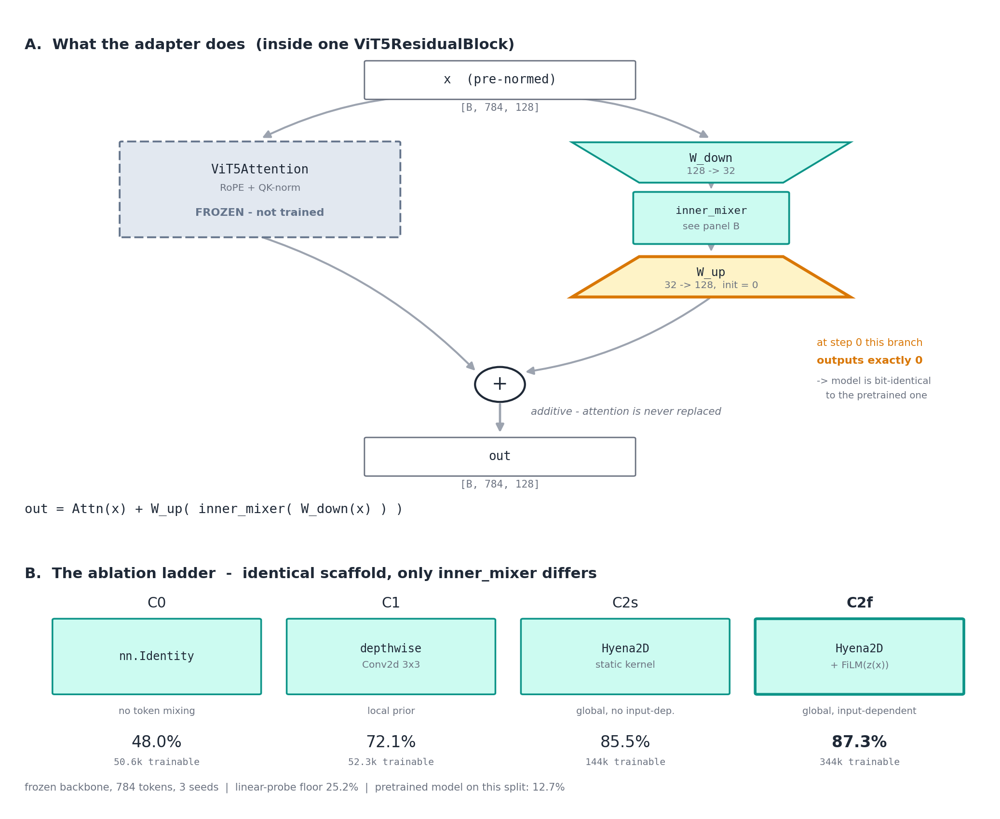

# Zero-Init Parallel Hyena2D Adapter — Toy Validation

## Question

Can a **zero-init parallel branch**, added alongside a frozen pretrained ViT's
attention, recover generalisation the pretrained model lacks — and if so, does the
gain come from the *structure* of the global implicit filter, or merely from extra
trainable parameters?

The adapter computes

```
out = Attn(x) + W_up( inner_mixer( W_down(x) ) )
```

with `W_up` zero-initialised, so at step 0 the model is bit-exactly the pretrained
one. Nothing is removed; the branch is one extra summand into the residual stream.



*(generated by `plot_adapter_diagram.py`; SVG alongside)*

______________________________________________________________________

## Task

A 16×16 MNIST digit is placed on a 112×112 canvas. The classifier reads out from
**only the bottom-right patch token** (`readout="corner"`), so digit identity must
be routed across the grid to a fixed distant location. GAP or CLS readout would let
the model bypass routing entirely and were deliberately rejected.

|                             | value                      |
| --------------------------- | -------------------------- |
| canvas                      | 112 × 112                  |
| patch size                  | 4 → **28×28 = 784 tokens** |
| digit                       | 16 px = 4×4 patches        |
| hidden dim / blocks / heads | 128 / 6 / 4                |
| bottleneck rank             | 32                         |
| CLS, registers, padding     | none — `T` is exactly 784  |

**Split.** Pretrain with `placement="fixed"` (digit always top-left) — the model
learns one routing path. Fine-tune and evaluate with `placement="random"`.

**Headroom.** The pretrained model scores **98.6% on fixed** but **12.7% on random**
(chance = 10%). An 85.9 pp gap: it knows the task and cannot transfer the routing.
Every arm measures how much of that gap its adapter recovers, with the backbone
frozen so the recovery is attributable to the adapter alone.

______________________________________________________________________

## Arms

All share one scaffold — same placement, same zero-init, same rank 32, same frozen
backbone — differing only in `inner_mixer`.

| arm     | `inner_mixer`                    | trainable        | what it isolates                    |
| ------- | -------------------------------- | ---------------- | ----------------------------------- |
| **A**   | *(no adapter — linear probe)*    | 1,408 (0.11%)    | what frozen features already encode |
| **C0**  | `nn.Identity`                    | 50,560 (3.78%)   | capacity, zero token mixing         |
| **C1**  | depthwise Conv2d 3×3             | 52,288 (3.91%)   | local prior                         |
| **C2s** | Hyena2D, **static** SIREN kernel | 144,448 (10.10%) | global mixing, input-independent    |
| **C2f** | Hyena2D + FiLM — **HyenaND**     | 343,744 (21.10%) | global mixing, input-dependent      |

Arm A is the pretrained network completely unmodified; only `out_norm` + `out_proj`
train. Parameter counts are deliberately *not* matched — the ladder varies structure
at fixed rank. See "What would decide it" for why that limits the conclusion.

Freezing is enforced by `experiments/callbacks/freeze_backbone.py`, which runs in
Lightning's `setup()` (before `configure_optimizers`, so frozen tensors never enter
the optimiser) and raises if no parameter matches its patterns.

______________________________________________________________________

## Results — 784 tokens, frozen backbone, 3 seeds

| arm                          | accuracy  | gap recovered |
| ---------------------------- | --------- | ------------- |
| A — head only (linear probe) | 25.2%     | 14 / 86 pp    |
| C0 — bottleneck, no mixer    | 48.0%     | 41 pp         |
| C1 — local 3×3 conv          | 72.1%     | 69 pp         |
| C2s — Hyena, static          | 85.5%     | 84 pp         |
| **C2f — Hyena + FiLM**       | **87.3%** | **86 pp**     |

Monotonic, large gaps, tight across seeds. Reading the ladder:

- Frozen features alone give **25.2%** — barely above chance.
- Channel re-projection with *no token mixing* nearly doubles that (**48.0%**),
  which means the frozen attention *is* already delivering usable information to
  the corner; it just needs decoding.
- Local mixing adds **+24 pp**, global mixing a further **+13 pp**, input-dependence
  a further **+1.8 pp**.

### Displacement buckets

Bucketed by L2 distance from digit to readout corner. Edges are in **patch units**,
chosen to bracket C1's receptive field (6 blocks × 3×3 ≈ 13 patches) — a percentile
split would put its first edge at ~14 patches, leaving no bucket inside local reach.

| arm | 0–6   | 6–12  | 12–20 | 20+ patches |
| --- | ----- | ----- | ----- | ----------- |
| A   | 30.3% | 21.7% | 25.7% | 25.6%       |
| C0  | 49.1% | 44.4% | 48.7% | 48.7%       |
| C1  | 71.6% | 72.6% | 72.8% | 71.4%       |
| C2s | 80.3% | 86.9% | 85.9% | 84.9%       |
| C2f | 82.9% | 88.7% | 87.7% | 86.7%       |

*(n = 222 / 1518 / 3446 / 4814 of 10,000)*

Margins, in pp:

| comparison                    | 0–6   | 6–12  | 12–20 | 20+   |
| ----------------------------- | ----- | ----- | ----- | ----- |
| C2f − C1 (global vs local)    | +11.3 | +16.1 | +14.9 | +15.3 |
| C2f − C0 (mixing vs capacity) | +33.8 | +44.2 | +39.1 | +38.1 |
| C2f − C2s (FiLM)              | +2.6  | +1.7  | +1.8  | +1.8  |
| C1 − C0 (local vs capacity)   | +22.5 | +28.2 | +24.2 | +22.7 |

### The decision rule does not fire — stated plainly

The brief's test for inductive bias was that the margin should **grow with
displacement**: small when the digit is near (both mixers cope), large when far
(only global mixing reaches). Instead every margin is **flat** beyond the first
bucket. The apparent dip at 0–6 patches rests on 222 samples with ±3.5% seed
spread and is not distinguishable from noise.

By the rule as written, this is the **capacity** reading, not the inductive-bias
reading. C2f carries 6.6× C1's parameters, and that explanation is not excluded.

### But the rule has no power in this setting

The rule assumes the baseline is distance-limited. It is not:

- **C1 is flat at ~72% out to 20+ patches**, far beyond its ~13-patch receptive
  field. A purely local adapter should collapse at distance. It doesn't.
- **No arm shows displacement dependence** — not even the linear probe.

The reason is that every arm retains the frozen backbone's **full all-to-all
attention**. Distance never blocks information *flow*; C0 reaching 48% with zero
token mixing is direct evidence that attention already carries digit information to
the corner. What the frozen attention gets wrong at unfamiliar offsets is how to
*use* what it delivers.

So the adapter is not buying **reach** — it is buying **re-routing**, correcting a
mis-calibrated but globally-connected backbone. That correction is needed about
equally at every displacement, which is exactly the flat profile observed.

The displacement axis is the right test for a baseline that cannot reach. It is the
wrong test when the frozen backbone is itself a full transformer.

### Which depths use the adapter

Every block has an independent adapter whose `W_up` starts at exactly zero, so the
per-depth profile after training shows where the model *chose* to use it.

**Weight norm ‖W_up‖\_F** (seed 0):

| arm | blk0 | blk1 | blk2 | blk3 | blk4 | blk5 |
| --- | ---- | ---- | ---- | ---- | ---- | ---- |
| C0  | 1.57 | 1.47 | 1.56 | 1.57 | 2.05 | 2.05 |
| C1  | 2.32 | 2.19 | 2.03 | 2.08 | 2.18 | 2.43 |
| C2s | 0.92 | 0.91 | 0.96 | 1.23 | 1.67 | 3.43 |
| C2f | 0.90 | 0.94 | 0.97 | 1.34 | 1.63 | 3.48 |

**Do not read contribution off that table.** Measuring the branch directly —
‖adapter output‖ / ‖attention output‖ on real data, 3 seeds — gives a much weaker
effect and, for C1, the opposite sign:

| arm | blk0     | blk1 | blk2 | blk3 | blk4 | blk5 | trend           |
| --- | -------- | ---- | ---- | ---- | ---- | ---- | --------------- |
| C0  | 1.09     | 1.19 | 0.98 | 0.89 | 1.14 | 0.97 | flat            |
| C1  | **1.62** | 1.80 | 1.02 | 1.74 | 1.30 | 0.93 | **falls 0.58×** |
| C2s | 0.69     | 0.69 | 0.50 | 0.57 | 0.94 | 0.90 | rises 1.30×     |
| C2f | 0.63     | 0.79 | 0.58 | 0.64 | 0.87 | 0.98 | rises 1.54×     |

**Causal ablation** — zero one block's `W_up` at inference, measure the accuracy
drop (3 seeds, n=3072). This is the only measure that establishes *importance*
rather than magnitude:

| arm | blk0      | blk1      | blk2      | blk3      | blk4      | blk5          |
| --- | --------- | --------- | --------- | --------- | --------- | ------------- |
| C0  | .246±.030 | .223±.049 | .272±.022 | .233±.019 | .264±.010 | **.099±.011** |
| C1  | .376±.038 | .444±.082 | .413±.054 | .334±.031 | .337±.019 | **.190±.034** |
| C2s | .534±.103 | .342±.054 | .345±.087 | .280±.022 | .426±.033 | **.258±.031** |
| C2f | .222±.039 | .299±.084 | .379±.152 | .338±.083 | .389±.042 | **.250±.022** |

Conclusions, in decreasing order of confidence:

1. **The final block's adapter is the least important, in every arm.** This is the
   one depth result that survives seed variance. All other per-block orderings sit
   inside the spread (C2f blk2 is ±.152) and must not be ranked.

1. **Magnitude measures point the wrong way.** Block 5 has the *largest* ‖W_up‖
   (3.43 vs 0.91) and the *largest* activation contribution (0.98 vs 0.63), yet
   ablating it costs the *least*. Neither weight norm nor activation ratio predicts
   causal importance. The brief requested a ‖W_up‖-per-layer plot as a deliverable;
   read naively it yields the opposite of the correct conclusion, so it should be
   published only alongside this ablation.

1. **Blocks are strongly co-adapted.** Removing any single block's adapter costs
   20–53 pp — far more than a 1/6 share — so contributions are not additive and
   per-depth attribution is inherently limited.

1. **The Hyena adapter achieves more while perturbing less.** C1's branch output
   *exceeds* the frozen attention's (1.62× at block 0) and still lands 15 pp behind
   C2f, whose branch stays *below* attention (0.63×) through most of the stack. For
   the intended use — adapting a pretrained encoder without disturbing it — a large
   gain at a small relative perturbation is the desirable property.

An earlier version of this report claimed the Hyena arms "concentrate usage in the
final block" and that the model "wants global mixing right before readout". That was
inferred from ‖W_up‖ alone and is **retracted**; the ablation shows the opposite.

______________________________________________________________________

## What would decide capacity vs. inductive bias

A **parameter-matched control**: C1 with a wider kernel (7×7 depthwise, or a
two-layer conv stack) raised to ≈343k params while staying strictly local.

- C2f still wins → inductive bias
- C1-wide catches up → capacity

Roughly three runs. This is the single highest-value follow-up; until it exists the
headline ordering is real but its *cause* is not settled.

______________________________________________________________________

## Earlier 196-token runs

### Invalidated: no arm froze the backbone

The first run at 196 tokens (56×56 canvas) had **no freezing at all** — nothing in
`experiments/` set `requires_grad = False`. Every arm trained all parameters, so the
labels described nothing:

| label                     | what actually ran               |
| ------------------------- | ------------------------------- |
| A "head only"             | full fine-tune, no adapter      |
| C0/C1/C2 "head + adapter" | full fine-tune + adapter        |
| D "full fine-tune"        | **identical experiment to A**   |
| E "full + adapter"        | **identical experiment to C2s** |

The results are their own evidence — A (94.89%) ≈ D (94.74%) and C2s (97.03%) ≈ E
(96.90%), two pairs designed to differ landing within noise.

Those numbers, for the record: A 94.9 · C0 95.0 · C1 98.0 · C2s 97.0 · C2f 97.1 ·
D 94.7 · E 96.9. Note C1 *beat* C2 there. That ordering reversed once freezing was
fixed, because an unfrozen backbone compensates for a weak adapter and compresses
all arms into 95–98%.

An explanation previously offered here for A ≈ D (attention overfitting to one
routing pattern) was invented to account for a bug and is **retracted**.

### FiLM decomposition at unchanged scale

To separate "FiLM was missing" from "the grid was too small", C2f was run at the
**unchanged** 196-token grid from the same checkpoint:

| arm (196, unfrozen) | mean   | std   |
| ------------------- | ------ | ----- |
| C1                  | 98.02% | 0.25% |
| C2f                 | 97.09% | 0.08% |
| C2s                 | 97.03% | 0.21% |

**C2f − C2s = +0.07 pp** against 0.16 pp pooled std — no effect. So the missing
`film_cfg` was a real mislabel (C2 was not HyenaND) but was *not* why C2 lost to C1
there. At 784 tokens the same comparison gives +1.8 pp, so input-dependence begins
paying only at the larger grid.

This is a FiLM on/off ablation at matched settings, which neither the paper nor the
rest of this repo contains.

______________________________________________________________________

## Task artifacts

Two properties of the data, neither of which biases the arm comparison (all arms
see identical inputs), but both of which should be known before reusing the
datamodule:

1. **The digit sits in a visibly darker box.** The canvas is zero-filled while the
   pasted MNIST crop carries its own normalised background of −0.424, so the 16×16
   region is delineated. This makes *localisation* nearly free. It does not help
   *identity transport*: the box is byte-identical for every class. Fix for the next
   scale-up: fill the canvas with −0.424 instead of 0.0 (changes the input
   distribution, so it needs a fresh pretrain).

1. **The readout marking is unnecessary; the exclusion zone is not.** Two separate
   mechanisms, often conflated:

   - *The −1.0 fill* carries zero information — verified over 200 samples spanning
     all 10 classes, the corner patch has variance `0.000e+00` and a single value.
     It is vestigial from the copy/regression task, where it marks *where to paint*.
     For classification `readout_value=0.0` is equally information-free, since
     token 783's layer-0 content is constant either way.
   - *The placement exclusion* is required. `_precompute_valid_positions` bars the
     bottom-right quadrant using only `canvas_size` and `target_size` —
     independently of `readout_value` — so the digit can never land on the readout
     token. Without it, a fraction of samples would be solvable locally with no
     routing, contaminating the measurement.

   Recommended change for the next round: `readout_value=0.0`. The marking
   disappears, the exclusion is untouched. Expected to be near-neutral, but it is an
   untested assumption — a translation-equivariant kernel could be using the marked
   region as an anchor even though `pos_embed` already supplies absolute position.

See `task_samples.png` (generated by `plot_task_samples.py`).

______________________________________________________________________

## Relation to the paper

Wessels et al., *Native Multi-Dimensional Subquadratic Operators via Input Dependent
Long Convolutions* (arXiv:2607.19378), ImageNet-1K, ViT-5-Small 22M, patch 16:

| config             | top-1     |
| ------------------ | --------- |
| Attention baseline | 81.8%     |
| Pure HyenaND       | 81.5%     |
| Hybrid `(HA)×6`    | **82.1%** |
| Hybrid `(HHHA)×3`  | 82.0%     |

Two points bearing on this work:

- **All hybrids there are layer-interleaved.** There is no parallel in-block
  variant, so the design tested here remains an open gap; the interleaved result
  must not be cited as evidence for it.
- **The operator is input-dependent by definition** —
  `K_i(x) = w(c_i) ⊙ f_θ(c_i; z(x))`, with FiLM supplying the dependence, and FiLM
  initialised to `(γ, β) = (1, 0)` so it is unmodulated at init. A branch built with
  `film_cfg=None` is a *static* implicit long convolution and must not be reported
  as HyenaND. That is the distinction between arms C2s and C2f.

______________________________________________________________________

## What this still cannot show

- **Capacity vs. inductive bias** — pending the parameter-matched C1-wide arm.
- **Forgetting safety** — the toy has no valuable pretrained representation to lose,
  which is the entire reason zero-init matters for the real target. Testing it needs
  joint pretraining (spatial recall **and** plain classification), fine-tuning on
  recall only, then measuring classification degradation. Frozen arms should degrade
  far less than full fine-tuning; that number is the one that transfers.
- **Anything about real domain shift** — MNIST-on-canvas is a routing probe, not a
  distribution-shift benchmark.

______________________________________________________________________

## Reproducing

```bash
# Phase 1 — pretrain (fixed placement), ~3.5 h on one A6000
PYTHONPATH=. python experiments/run.py \
    --config examples/hyena2d_parallel_adapter/lg_pretrain.py seed=0

# Phase 2 — all arms x 3 seeds, 2 GPUs, ~8 h
CKPT=<entity>/<project>/<run_id>
PYTHONPATH=. python experiments/run.py \
    --config examples/hyena2d_parallel_adapter/lg_arm_c2f.py \
    start_from_checkpoint.run_path=$CKPT seed=0

# Analysis — buckets, W_up norms, raw per-sample data
PYTHONPATH=. python reports/hyena2d_parallel_adapter/analyze_784.py
```

Artifacts in this folder: `buckets_784.json`, `wup_norms_784.json`,
`raw_784.json` (per-sample correctness + displacement, so buckets can be recut
without re-running inference), `task_samples.png`.
