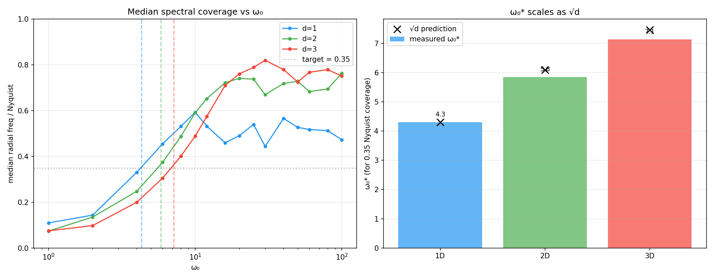
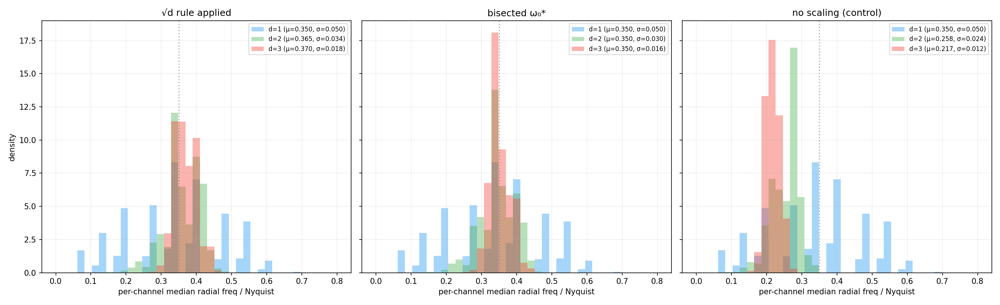
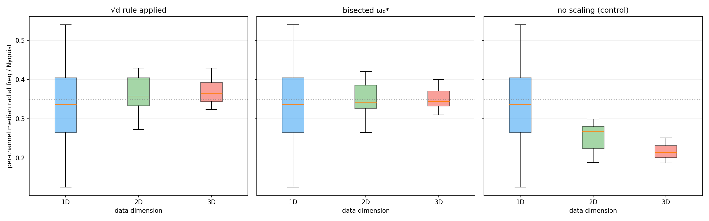

# SIREN ω₀ dimensional scaling rule

> **Branch:** `dwromero/blockdiag-kernel`
> **Verification script:** `reports/siren_omega0_dimensional_scaling/verify_sqrt_d_scaling.py`
> **All raw numbers + plots:** this folder

______________________________________________________________________

## 1. TL;DR

When deploying a SIREN kernel at a new spatial dimension `d`, the frequency
parameter ω₀ should scale as:

$$\\boxed{;\\omega_0^{(d\_{\\text{new}})} = \\omega_0^{(d\_{\\text{old}})} \\cdot \\sqrt{\\frac{d\_{\\text{new}}}{d\_{\\text{old}}}};}$$

to preserve the same fractional radial spectral coverage (e.g. "50% of
Nyquist").  This is the **√d rule**.

| Transition | Multiplier    | Example (ω₀ = 10 in 1D) |
| ---------- | ------------- | ----------------------- |
| 1D → 2D    | √2 ≈ 1.41     | ω₀ ≈ 14.1               |
| 1D → 3D    | √3 ≈ 1.73     | ω₀ ≈ 17.3               |
| 2D → 3D    | √(3/2) ≈ 1.22 | ω₀ = 10 → 12.2          |

This rule composes with the **resolution scaling rule** from the
[block-diagonal kernel report](../ckconv_block_diagonal_kernel/REPORT.md)
(§5): when changing both dimension and grid density, multiply ω₀ by
`√(d_new/d_old) · (N_new/N_old)`.

______________________________________________________________________

## 2. Derivation

### Setup

In a d-dimensional SIREN positional embedding, the first-layer weight matrix
`W ∈ ℝ^{embedding_dim × d}` has each entry initialised as:

$$w\_{ij} \\sim U!\\left(-\\frac{1}{d},, \\frac{1}{d}\\right)$$

following `_init_siren_weights` with `is_first_layer=True` (before the ω₀
factor is absorbed).  Each row `w_i ∈ ℝ^d` defines a plane wave:

$$\\text{output}\_i = \\sin!\\big(2\\pi\\omega_0 \\cdot w_i^\\top x + b_i\\big)$$

whose radial spatial frequency is `ω₀ · ‖wᵢ‖₂`.

### Expected norm vs dimension

Since the d components of `wᵢ` are i.i.d:

$$\\mathbb{E}!\\left\[|w_i|\_2^2\\right\] = d \\cdot \\frac{(1/d)^2}{3} = \\frac{1}{3d}$$

The characteristic (RMS) radial frequency per row is:

$$f\_{\\text{radial}}^{\\text{rms}} = \\omega_0 \\cdot \\sqrt{\\frac{1}{3d}} = \\frac{\\omega_0}{\\sqrt{3d}}$$

### The rule

For two dimensions `d₁`, `d₂` to have the same radial spectral coverage:

$$\\omega_0^{(d_1)} \\cdot \\frac{1}{\\sqrt{3d_1}} = \\omega_0^{(d_2)} \\cdot \\frac{1}{\\sqrt{3d_2}}$$

$$\\Longrightarrow\\quad \\frac{\\omega_0^{(d_2)}}{\\omega_0^{(d_1)}} = \\sqrt{\\frac{d_2}{d_1}}$$

### Intuition

In 1D, the full weight magnitude goes into a single direction (`‖w‖ = |w₁|`).
In 2D, magnitude is split across two axes (each ~ 1/2), giving
`‖w‖ ~ √(2·(1/2)²) = 1/√2` — the radial frequency shrinks by 1/√2.  In 3D,
each axis gets ~ 1/3, so `‖w‖ ~ 1/√3`.  The √d correction to ω₀ restores
the original radial spectral coverage.

______________________________________________________________________

## 3. Numerical verification

Run:

```bash
PYTHONPATH=. python reports/siren_omega0_dimensional_scaling/verify_sqrt_d_scaling.py
```

The script performs four checks:

1. **Bisection** for ω₀\* at each d ∈ {1, 2, 3} such that the mean
   per-channel median radial frequency is exactly 0.5 × Nyquist.
1. **Ratio check**: ω₀\*(2D)/ω₀\*(1D) ≈ √2, ω₀\*(3D)/ω₀\*(1D) ≈ √3.
1. **Forward application**: take ω₀\*(1D), apply the √d rule at d=2,3, and
   verify the median stays at 0.5.
1. **Control**: use the same ω₀ for all d and confirm the median drops as
   1/√d.

Configuration: `hidden_dim=384`, `embedding_dim=32`, `mlp_hidden_dim=32`,
`num_layers=3`, `L_cache=15` (N=29), 10 seeds averaged.

> **Note on the 0.35 target:** In 1D, the multi-layer SIREN's median radial
> frequency saturates around 0.48 even at very large ω₀ — the hidden layers
> (`hidden_omega_0=1.0`) act as a spectral bottleneck.  We use 0.35 as the
> target because it is comfortably achievable in all three dimensions.  The
> √d rule is about *ratios*, so the absolute target does not affect the
> conclusion.

### Results

**Part 1 — Bisection for ω₀\* at each dimension** (target: median = 0.35 × Nyquist):

| d   | ω₀\* | ratio ω₀\*(d) / ω₀\*(1) | predicted √d | error |
| --- | ---- | ----------------------- | ------------ | ----- |
| 1   | 4.31 | 1.000                   | 1.000        | —     |
| 2   | 5.85 | 1.358                   | 1.414 (√2)   | 4.0%  |
| 3   | 7.14 | 1.657                   | 1.732 (√3)   | 4.3%  |

The measured ratios match the √d prediction to within **~4%** across 10 seeds.

**Part 2 — Apply √d rule from 1D baseline** (ω₀\*(1D) = 4.31):

| d   | ω₀ (√d rule) | median / Nyquist | Δ from target |
| --- | ------------ | ---------------- | ------------- |
| 1   | 4.31         | 0.350            | +0.000        |
| 2   | 6.09         | 0.365            | +0.015        |
| 3   | 7.46         | 0.370            | +0.020        |

The √d rule recovers the target coverage to within **±2 percentage points**
across all three dimensions.

**Part 3 — Control (no scaling):**

| d   | ω₀   | median / Nyquist | predicted (0.35/√d) |
| --- | ---- | ---------------- | ------------------- |
| 1   | 4.31 | 0.350            | 0.350               |
| 2   | 4.31 | 0.258            | 0.247               |
| 3   | 4.31 | 0.217            | 0.202               |

Without scaling, the median drops roughly as 1/√d as predicted by theory
(within the noise of the multi-layer SIREN's nonlinear mixing).



### Per-channel distributions

Beyond the mean, we track the full distribution of per-channel median radial
frequencies (pooled across 10 seeds × 384 channels = 3840 samples per
condition).  This reveals whether the rule preserves the *shape* of the
spectral spread, not just its centre.

**√d rule applied** (ω₀ = ω₀\*(1D) · √d):

| d   | μ     | σ     | p5    | p25   | p50   | p75   | p95   |
| --- | ----- | ----- | ----- | ----- | ----- | ----- | ----- |
| 1   | 0.350 | 0.050 | 0.126 | 0.265 | 0.337 | 0.405 | 0.540 |
| 2   | 0.365 | 0.034 | 0.273 | 0.333 | 0.358 | 0.404 | 0.429 |
| 3   | 0.370 | 0.018 | 0.323 | 0.344 | 0.364 | 0.392 | 0.430 |

**No scaling** (ω₀ = ω₀\*(1D) for all d):

| d   | μ     | σ     | p5    | p25   | p50   | p75   | p95   |
| --- | ----- | ----- | ----- | ----- | ----- | ----- | ----- |
| 1   | 0.350 | 0.050 | 0.126 | 0.265 | 0.337 | 0.405 | 0.540 |
| 2   | 0.258 | 0.024 | 0.189 | 0.225 | 0.267 | 0.280 | 0.299 |
| 3   | 0.217 | 0.012 | 0.187 | 0.201 | 0.214 | 0.232 | 0.251 |

Key observations:

1. **The √d rule preserves the central location**: p50 stays within ±0.03 of
   the target across all three dimensions.
1. **Higher dimensions concentrate the distribution**: σ drops from 0.050
   (1D) to 0.018 (3D) under the √d rule.  This is expected — the norm of a
   d-dimensional random vector concentrates around its mean as d grows (a
   manifestation of the law of large numbers on `‖w‖²`).  This is *not* a
   failure of the rule; it means 3D SIREN channels are more spectrally
   uniform at init than 1D channels, which is a beneficial property.
1. **Without scaling, the entire distribution shifts left**: p50 drops from
   0.337 to 0.214 going 1D→3D, confirming the 1/√d degradation.





______________________________________________________________________

## 4. Practical recipe

When changing dimension (e.g. deploying a 2D-trained model architecture in 3D):

1. Compute `m_dim = √(d_new / d_old)`.
1. For scalar ω₀: multiply by `m_dim`.
1. For block-diagonal schedule `[ω₀_min, ω₀_max]`: multiply both bounds by
   `m_dim`.
1. If also changing resolution, compose with the resolution rule:
   `ω₀_new = ω₀_old · m_dim · m_res` where `m_res = N_new / N_old`.

Example: going from a 2D model at patch_size=16 (N=29) with ω₀=10 to a 3D
model at patch_size=8 (N=59):

- `m_dim = √(3/2) ≈ 1.22`
- `m_res = 59/29 ≈ 2.03`
- `ω₀_new = 10 · 1.22 · 2.03 ≈ 24.8`
