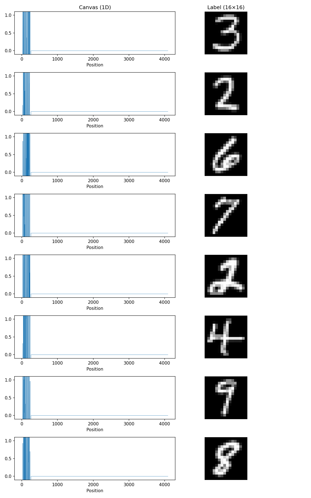
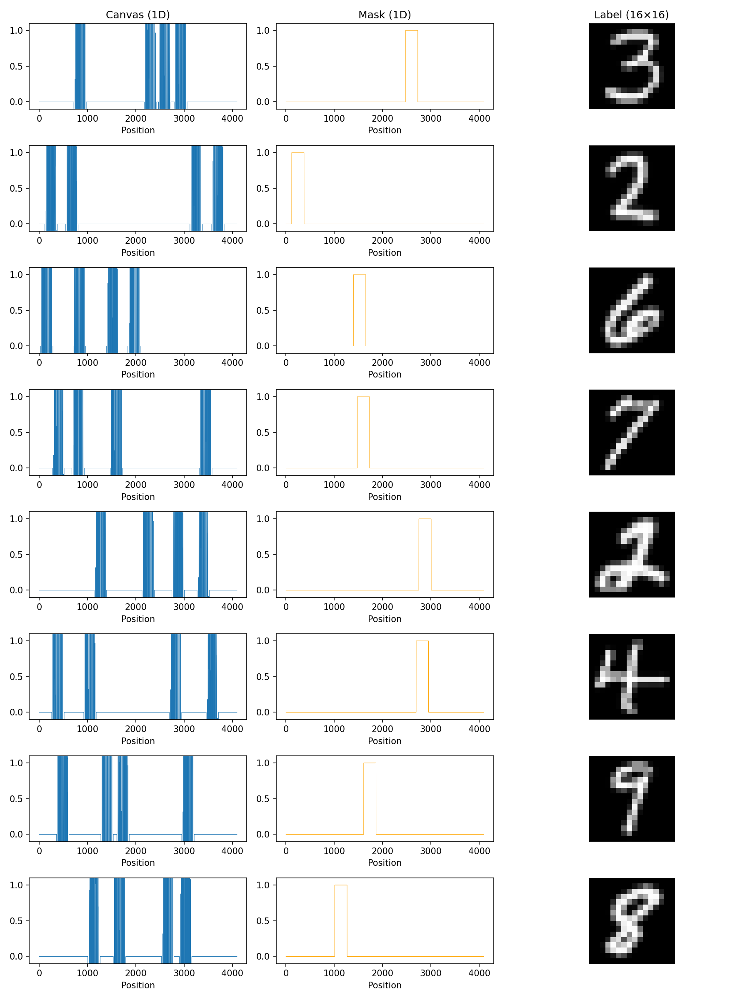
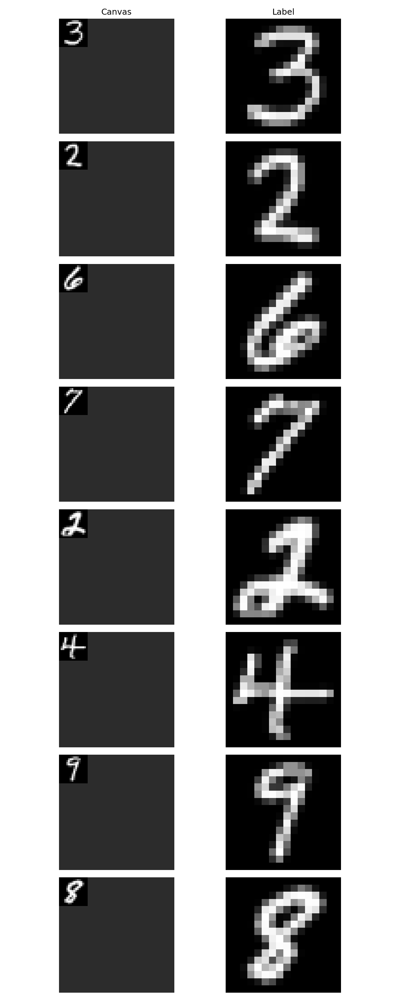
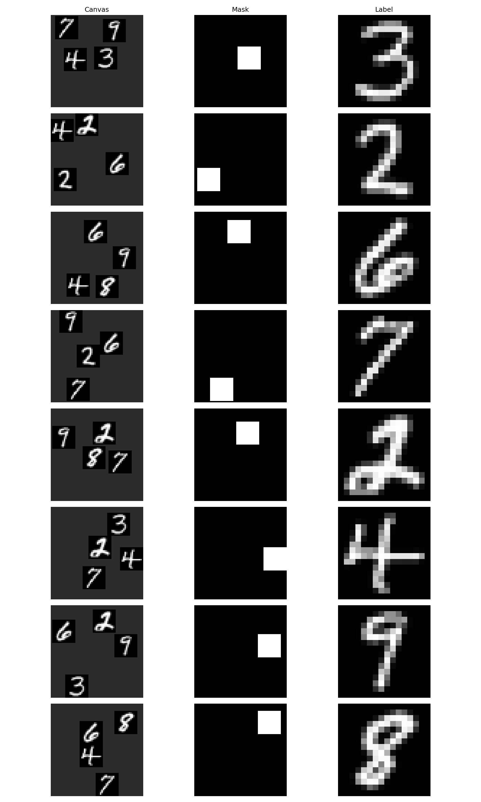
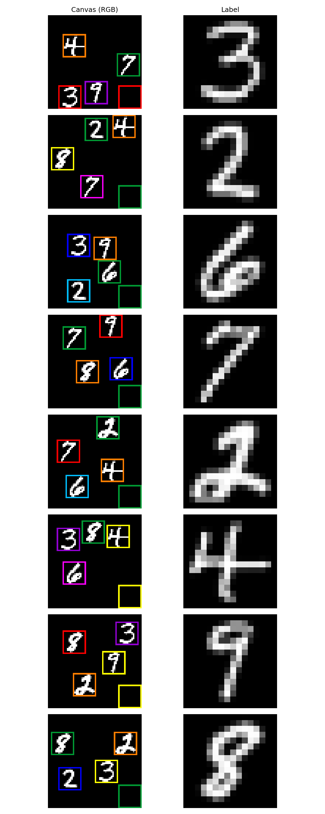
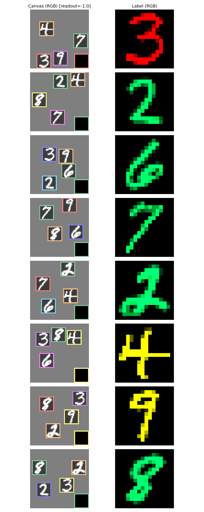
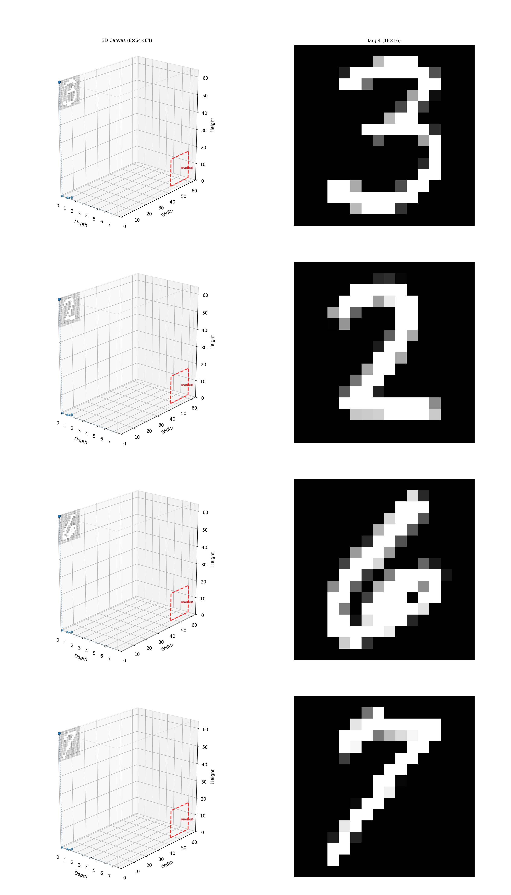
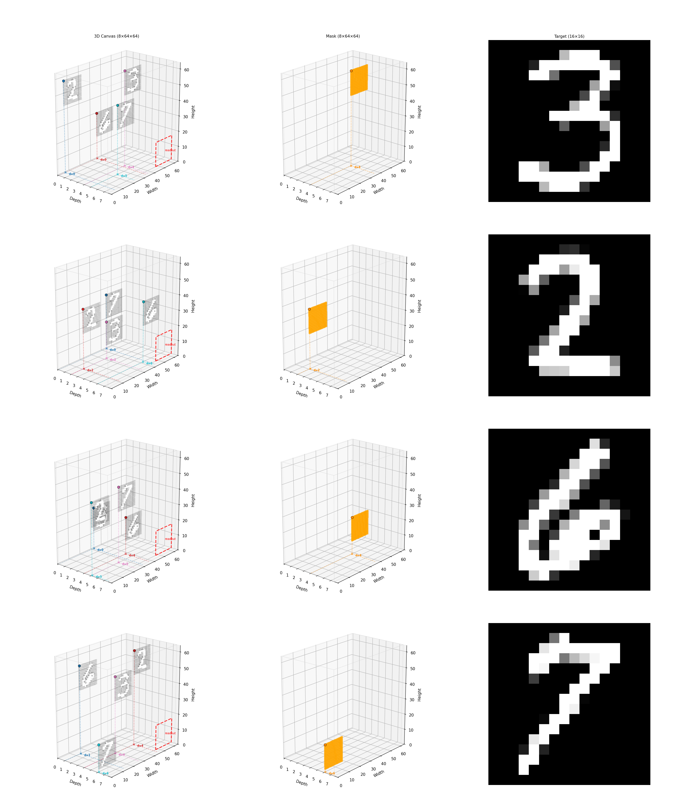
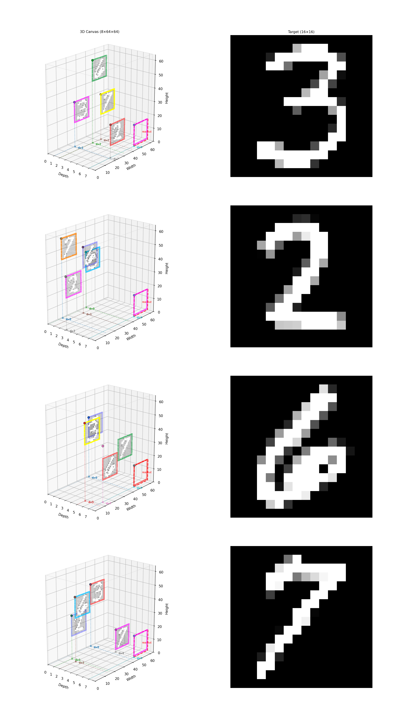
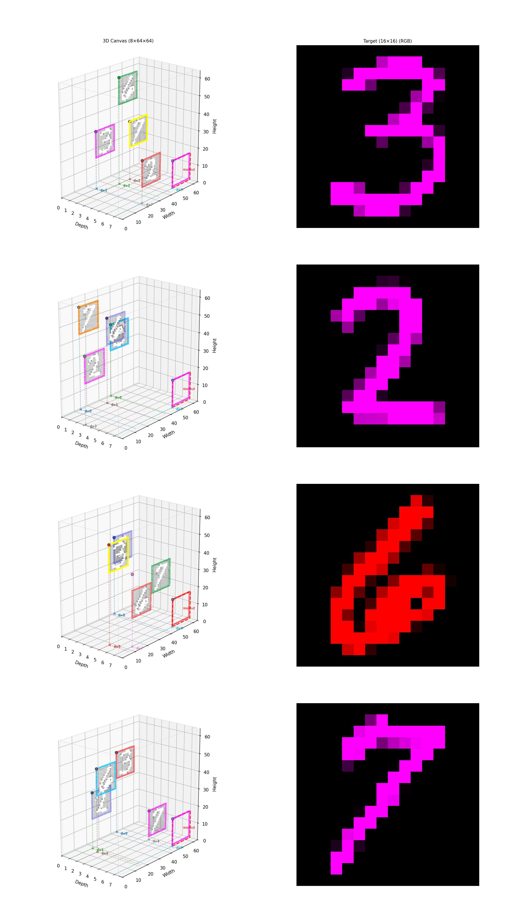

# Spatial recall — qualitative samples

Reference figures for the EMNIST spatial-recall task suite (1D, 2D,
3D).  Each figure shows ground-truth target vs model prediction for
the matching example config under
[`examples/spatial_recall_*`](../../examples/).  These are illustrative
qualitative snapshots — see the per-task `examples/.../*/README.md` for
the task specification and quantitative metrics.

## 1D

### Simple copy

A single EMNIST digit is presented at the start of a 1D sequence; the
model must reproduce it at a fixed readout offset later in the
sequence.



Config: [`examples/spatial_recall_1d/emnist_regression_simple_copy/`](../../examples/spatial_recall_1d/emnist_regression_simple_copy/)

### Mask selection (4 items)

Four EMNIST digits are placed at random positions along the sequence;
the model must reproduce the digit whose position matches a
1-hot "mask" channel.



Config: [`examples/spatial_recall_1d/emnist_regression_mask_selection/`](../../examples/spatial_recall_1d/emnist_regression_mask_selection/)

## 2D

### Simple copy

A single digit at a fixed position on a 2D canvas; the model must
reproduce it at the readout corner.



Config: [`examples/spatial_recall_2d/emnist_regression_simple_copy/`](../../examples/spatial_recall_2d/emnist_regression_simple_copy/)

### Mask selection (4 items)

Four digits on a 2D canvas; the model selects which to reproduce
using a 1-hot spatial mask channel.



Config: [`examples/spatial_recall_2d/emnist_regression_mask_selection/`](../../examples/spatial_recall_2d/emnist_regression_mask_selection/)

### Color selection (4 items)

Four colour-labelled digits; the model selects which to reproduce
based on a target colour passed as a side channel.



Config: [`examples/spatial_recall_2d/emnist_regression_color_selection/`](../../examples/spatial_recall_2d/emnist_regression_color_selection/)

### Color conditioning (4 items)

Like *color selection*, but the conditioning channel chooses the
output colour rather than the source digit — tests the FiLM
conditioning path.



Config: [`examples/spatial_recall_2d/emnist_regression_color_conditioning/`](../../examples/spatial_recall_2d/emnist_regression_color_conditioning/)

## 3D (2D slice views)

3D tasks place digits on slices of a `[D, H, W]` volume; the readout
sits on the last depth slice's bottom-right corner.  The figures below
show one 2D slice of the prediction volume for clarity.

### Simple copy (2D slice)



Config: [`examples/spatial_recall_3d/emnist_regression_simple_copy/`](../../examples/spatial_recall_3d/emnist_regression_simple_copy/)

### Mask selection (4 items, 2D slice)



Config: [`examples/spatial_recall_3d/emnist_regression_mask_selection/`](../../examples/spatial_recall_3d/emnist_regression_mask_selection/)

### Color selection (4 items, 2D slice)



Config: [`examples/spatial_recall_3d/emnist_regression_color_selection/`](../../examples/spatial_recall_3d/emnist_regression_color_selection/) (where present in the tree).

### Color conditioning (4 items, 2D slice)



Config: [`examples/spatial_recall_3d/emnist_regression_color_conditioning/`](../../examples/spatial_recall_3d/emnist_regression_color_conditioning/) (where present in the tree).

## How these were generated

Each figure was rendered from the validation-set predictions of the
matching example config.  To regenerate, train one of the configs
above and run the per-config visualisation callback (the example
configs ship the relevant `experiments/callbacks/*` entries):

```bash
PYTHONPATH=. conda run -n nv-subq python experiments/run.py \
    --config examples/spatial_recall_2d/emnist_regression_simple_copy/ccnn_hyena_xs.py
```

Visualisation PNGs are written by the
`Sequence1DVisualizationCallback` (1D) and
`ValidationImageGridCallback` / `ValidationVolumeGridCallback`
(2D / 3D) callbacks under the experiment's output directory; copy the
representative one into this folder when refreshing the report.
