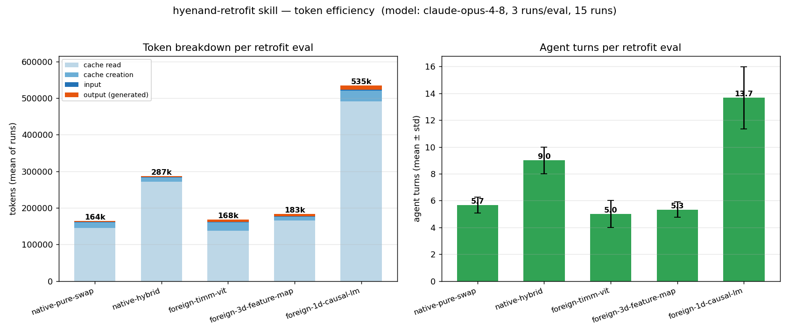

# Skill evals — future CI integration

This directory holds eval cases for the `hyenand-retrofit` skill. The **correctness** side (the grep assertions in `evals.json`) is still a **spec** — there is no harness that checks pass/fail yet, and the bulk of this README is the design for wiring that up later. The **token-efficiency** side, however, is built and measured: `bench_tokens.py` runs every eval through a real agent and records how much work each retrofit took in tokens, turns, and wall-clock. See [Token-efficiency benchmark](#token-efficiency-benchmark) for the latest numbers.

## What's here

| File                  | Purpose                                                                                                                                                                                                                                                                                        |
| --------------------- | ---------------------------------------------------------------------------------------------------------------------------------------------------------------------------------------------------------------------------------------------------------------------------------------------- |
| `evals.json`          | Five eval cases (native pure swap, native hybrid, foreign 2D ViT, foreign 3D feature-map U-Net, foreign 1D causal LM). Each case has a prompt, the input files the agent should see, an `expected_output` description, and a list of grep-based assertions against the file the agent writes.  |
| `inputs/*.py`         | Standalone test fixtures the agent retrofits. Each runs end-to-end (`python <file>` produces a forward-pass shape) so the harness can sanity-check the inputs themselves before evaluating the agent's output.                                                                                 |
| `bench_tokens.py`     | Token/turn/latency benchmark. Runs each eval through a fresh `claude -p` agent (skill text injected inline, `acceptEdits` so it actually writes the retrofit), parses the JSON usage envelope, and appends one row per run to `bench_results.jsonl`. Restores the working tree after each run. |
| `plot_tokens.py`      | Renders `bench_tokens.png` (stacked token breakdown + agent turns per eval) from `bench_results.jsonl`.                                                                                                                                                                                        |
| `bench_results.jsonl` | Raw per-run measurements — one JSON line per run (tokens, turns, duration, model).                                                                                                                                                                                                             |
| `bench_tokens.png`    | The rendered token-efficiency figure embedded below.                                                                                                                                                                                                                                           |

The evals together cover the four-axis grid from `SKILL.md`:

| Eval                     | data_dim | causal | host layout | prefix tokens |
| ------------------------ | -------- | ------ | ----------- | ------------- |
| `foreign-timm-vit`       | 2        | False  | tokens      | 1 (CLS)       |
| `foreign-3d-feature-map` | 3        | False  | feature_map | 0             |
| `foreign-1d-causal-lm`   | 1        | True   | tokens      | 0             |

`native-pure-swap` and `native-hybrid` cover the native path where the host already uses nvSubquadratic builders.

### What each eval retrofits

| eval                     | host model                                                                                    | what gets swapped                                                             | path & key challenge                                                                          |
| ------------------------ | --------------------------------------------------------------------------------------------- | ----------------------------------------------------------------------------- | --------------------------------------------------------------------------------------------- |
| `native-pure-swap`       | nvSubquadratic ViT-5 attention config                                                         | `build_attention_net` → `build_hyena_net` (pure HyenaND)                      | native — edit a config, no adapter needed                                                     |
| `native-hybrid`          | nvSubquadratic ViT-5 attention config                                                         | → `build_hybrid_net` with an `HHHA` layer pattern (3 Hyena + 1 attention, ×3) | native — edit a config                                                                        |
| `foreign-timm-vit`       | standalone tiny ViT using `nn.MultiheadAttention`, 64×64 images, 65 tokens                    | the block's `.attn` → HyenaND (`data_dim=2`)                                  | foreign — adapter reshapes `[B,65,C]`→`[B,8,8,C]`, peels the CLS token, returns `(out, None)` |
| `foreign-3d-feature-map` | standalone 3D U-Net with a `SpatialAttention3D` bottleneck (`F.scaled_dot_product_attention`) | the bottleneck → HyenaND (`data_dim=3`)                                       | foreign — channel-first `[B,C,D,H,W]` ↔ channel-last, no CLS to peel                          |
| `foreign-1d-causal-lm`   | standalone causal char-LM using causal `nn.MultiheadAttention`, sequence length 256           | the block's `.attn` → causal HyenaND (`data_dim=1`)                           | foreign — `is_causal`, RoPE, `exp_decay` mask, `omega_0=100`, adapter swallows `attn_mask`    |

## Token-efficiency benchmark

`bench_tokens.py` measures what it takes to invoke this skill: for each eval it spawns a fresh `claude -p` agent with `SKILL.md` injected inline, lets it carry out the retrofit (`--permission-mode acceptEdits`, so it really writes the sibling file), parses the JSON usage envelope Claude returns, and appends a row to `bench_results.jsonl`. `plot_tokens.py` renders the figure below. The working tree is restored after every run, so the benchmark leaves no diff behind.

**`claude-opus-4-8`, 3 runs/eval, 15 runs** (each cell is the per-run mean):

| eval                     | turns | output tok | billed tok | wall (s) |
| ------------------------ | ----: | ---------: | ---------: | -------: |
| `native-pure-swap`       |   5.7 |      2,144 |       164k |       31 |
| `native-hybrid`          |   9.0 |      2,810 |       287k |       53 |
| `foreign-timm-vit`       |   5.0 |      6,751 |       168k |       74 |
| `foreign-3d-feature-map` |   5.3 |      5,792 |       183k |       66 |
| `foreign-1d-causal-lm`   |  13.7 |     11,705 |       535k |      355 |



### Reading the table

**Turns** is the number of model↔tool round-trips the agent took to finish one retrofit — each turn is one model response, usually a `Read`/`Write`/edit cycle. It's the cleanest single proxy for how much work a retrofit was: every extra turn re-reads the cached context, which is what drives **billed tok** up. **Output tok** is what the agent actually generated (the retrofit code plus its reasoning); it's only ~2–3 % of billed tokens, because each cold `claude -p` process re-reads the large system-prompt cache on every turn. Dollar figures are deliberately omitted — see the caveats.

### Why the evals differ — and why `foreign-1d-causal-lm` is the heaviest

Turn counts aren't uniform because the evals demand different amounts of work:

- **Native swaps** (`native-pure-swap`, `native-hybrid`) only edit a config — read one or two files, write a short builder shim. Fewest turns, least output.
- **Foreign retrofits** must read the host model, design and write an adapter module, then reconcile it with the library's API — roughly 3× the output of a native swap.
- **`foreign-1d-causal-lm` is the outlier** (13.7 turns, ~12k output tokens — the most of any eval, ~1.7× the next-highest and ~2.7× the native swaps). It has the most constraints to satisfy at once: `is_causal=True` on `CKConvND` (and *not* `fft_padding='causal'`, which the library rejects), RoPE, an `exp_decay` mask, `omega_0=100`, plus an adapter that swallows `attn_mask`/`need_weights`. The agent frequently trips the `fft_padding='causal'` footgun, hits the validation error, and retries — so it iterates the most and generates the most code.

A separate 3× rerun of this eval confirmed the instability rather than smoothing it out: **5, 10, and 25 turns** — one run finished cleanly in 5, another ballooned to 25 turns and ~1.56M billed tokens. The skill *can* land this retrofit quickly; it just doesn't reliably steer the agent there. That makes the causal path the highest-value target for tightening `SKILL.md` (e.g. calling out the `fft_padding='causal'` rejection up front).

### Reproduce

```bash
python skills/hyenand-retrofit/evals/bench_tokens.py --runs 3      # default model: claude-opus-4-8
python skills/hyenand-retrofit/evals/plot_tokens.py
```

Pin a different model to track drift across releases with `--model claude-sonnet-4-6`. Use `--eval-id 5` to focus one case, or `--dry-run` to preview prompts without calling the API. Re-running appends to `bench_results.jsonl`; delete it first for a clean dataset.

### Caveats (so the numbers aren't over-read)

- **No dollar figures.** The CLI's `total_cost_usd` proved non-monotonic with token usage on multi-turn runs (a 629k-token run reported a higher cost than a 1.56M-token one) — cache-write churn across turns isn't captured cleanly — so we report turns and tokens, which are internally consistent.
- **Overhead dominates the billed total.** Each `claude -p` is a cold process that re-reads the full system-prompt cache every turn, so billed tokens are mostly fixed overhead, *not* skill-specific work. Compare **turns** and **output tok** across runs/models/skill revisions, not the billed total.
- **Skill injected inline.** `SKILL.md` (~16 KB) is prepended to each prompt to simulate the skill being loaded, because it lives under `skills/` and isn't auto-discovered by the CLI.
- **`acceptEdits` mode.** File writes auto-accept (the deliverable); Bash is auto-denied, so the agent writes the `__main__` smoke-test block but never runs it. Runtime verification is out of scope — this measures code-generation work only.
- **Cost, not correctness.** This harness does not check the grep assertions in `evals.json` (still a spec — below).

## Why CI for these

Three reasons, in order of value:

1. **Regression guard.** When SKILL.md is edited, the description, the four-axis
   decision tree, or the adapter skeleton may drift in a way that breaks a
   retrofit pattern that used to work. Running the evals on every skill change
   catches that early.
1. **Model-drift catch.** As Claude models update (4.7 → 4.8 → ...), the same
   skill text may be interpreted slightly differently. A weekly cron picks this
   up before the next user does.
1. **Documented behavior.** The asserts encode "what counts as a correct
   retrofit" in a machine-checkable form. Reviewers don't have to read SKILL.md
   to know what the skill claims to do — they can read evals.json.

## Recommended shape

Separate workflow, not bolted onto the main GPU CI in
[../../../.github/workflows/ci.yml](../../../.github/workflows/ci.yml). Reasons:

- The skill evals don't need a GPU — they only produce code, then grep it.
  `ubuntu-latest` is enough. No reason to bloat the Colossus-runner queue.
- The skill evals are LLM-driven and inherently flakier than the existing
  pytest suite. Keeping them in a separate workflow means a flake here doesn't
  block a code PR.
- The triggers are different: the GPU pipeline runs on every code change; the
  skill evals only need to run when the skill itself changes.

### Triggers

```yaml
on:
  pull_request:
    paths: ['skills/hyenand-retrofit/**']
  workflow_dispatch:          # manual button for ad-hoc runs
  schedule:
    - cron: '0 6 * * 1'       # weekly Monday 06:00 UTC — catches model drift
```

The `paths:` filter keeps cost down: skill changes are infrequent, code-only
PRs don't pay for skill evals.

### Two-layer cheap-first design

| Layer                                                                                              | Cost                            | When to run                                                 | Tool                                                  |
| -------------------------------------------------------------------------------------------------- | ------------------------------- | ----------------------------------------------------------- | ----------------------------------------------------- |
| **Trigger eval** — does the skill description cause Claude to load the skill for the eval prompts? | ~5 sec, ~\$0.001 per query      | Every PR touching the skill                                 | skill-creator's `run_eval.py` (already exists; reuse) |
| **Full eval** — does the agent produce a file that passes the asserts?                             | ~1-5 min, ~$0.05-$0.20 per eval | `pull_request` to main and `workflow_dispatch`; weekly cron | Custom harness, see sketch below                      |

Trigger eval is cheap enough to run on every skill PR. Full eval is reserved
for main-PR and manual triggers because a single run is ~$0.50-$1 total and
takes 5-25 minutes serial (or ~1-5 min with a GHA matrix).

### Parallelization

Run the five evals as a GHA matrix:

```yaml
strategy:
  fail-fast: false            # report all failures, not just the first
  matrix:
    eval: [native-pure-swap, native-hybrid, foreign-timm-vit, foreign-3d-feature-map, foreign-1d-causal-lm]
```

Each matrix job runs one eval. Wall-clock is bounded by the slowest single eval
(~5 min) at the cost of 5× concurrent ubuntu-latest runners.

### Flake handling

LLM outputs are not deterministic. The grep patterns in `evals.json` are
deliberately tolerant of surface-level variation (`data_dim\s*=\s*3`, not
`data_dim=3` exactly), but flakes will still happen. Two mitigations:

- **Retry once on failure.** A retry that still fails is a real failure;
  a retry that passes is a flake (note it for tracking, don't block the PR).
- **Treat the workflow as advisory at first.** Mark it non-blocking
  (`continue-on-error: true` or a separate non-required check) until you have
  a few weeks of data on its flake rate. Promote to required once stable.

## Open questions to resolve before building

1. **API key as a GHA secret.** Does the NVIDIA org policy allow
   `ANTHROPIC_API_KEY` in GitHub Actions secrets? If not, the full-eval layer
   is dead in the water and only trigger evals (which can run via the local
   `claude` CLI configured with a personal token) are viable.
1. **Cost budget.** At ~\$1/full-run × N PRs/week + cron, is the budget
   acceptable? If not, drop the per-PR trigger and run only on
   `workflow_dispatch` + weekly cron.
1. **Blocking vs advisory.** Should a failing eval block a PR merge?
   Recommend: advisory for the first few months, then promote to required if
   the flake rate is low.
1. **Skill maintenance frequency.** If the skill is touched ~once a quarter,
   the CI overhead may not be worth it vs. running `python run_evals.py`
   manually as part of any skill edit.

## Minimal harness sketch

The full eval harness is ~50 lines of Python. Core loop:

```python
# skills/hyenand-retrofit/evals/run_evals.py
import json, re, subprocess, pathlib, sys

REPO_ROOT = pathlib.Path(__file__).resolve().parents[3]
EVALS = json.load(open(pathlib.Path(__file__).parent / "evals.json"))["evals"]


def run_one(eval_case):
    # Spawn claude -p. NOTE: the skill now lives in skills/ (not .claude/skills/),
    # so it is NOT auto-discovered — reference SKILL.md explicitly in the prompt,
    # or symlink/copy it under .claude/skills/ for the duration of the eval run.
    prompt = eval_case["prompt"]
    result = subprocess.run(
        ["claude", "-p", prompt, "--output-format", "json"],
        cwd=REPO_ROOT,
        capture_output=True,
        text=True,
        timeout=600,
    )
    # Find the file the agent wrote (delta vs git HEAD).
    written = subprocess.run(
        ["git", "status", "--porcelain"], cwd=REPO_ROOT, capture_output=True, text=True
    ).stdout
    new_files = [
        line.split()[-1] for line in written.splitlines() if line.startswith("?? ")
    ]
    output_path = REPO_ROOT / new_files[0]
    text = output_path.read_text()

    fails = []
    for a in eval_case["assertions"]:
        kind, pattern = (
            a["check"].split(":", 1) if ":" in a["check"] else (a["check"], "")
        )
        if kind == "grep_output" and not re.search(pattern, text):
            fails.append(a["text"])
        elif kind == "grep_output_negative" and re.search(pattern, text):
            fails.append(f"(negative) {a['text']}")
    return fails, output_path


if __name__ == "__main__":
    failed = 0
    for e in EVALS:
        fails, path = run_one(e)
        status = "PASS" if not fails else "FAIL"
        print(f"[{status}] #{e['id']} {e['name']}  ({path.name})")
        for f in fails:
            print(f"    - {f}")
        failed += bool(fails)
    sys.exit(1 if failed else 0)
```

Caveats this sketch glosses over:

- Cleaning up the agent's written file between evals (so the next eval's
  "files written since HEAD" doesn't include the previous output)
- Handling the `original_unmodified` and `sibling_location` assertion kinds
  (which need filesystem inspection, not grep)
- Per-eval working-directory isolation if evals are matrix-parallelized
- Passing the eval's `files` input list to the agent so it knows what to read

The skill-creator plugin's
[scripts/run_eval.py](../../../.claude/plugins/marketplaces/claude-plugins-official/plugins/skill-creator/skills/skill-creator/scripts/run_eval.py)
already handles the `claude -p` spawn correctly (uuid-named command file for
skill discovery, partial-message stream parsing for fast trigger detection).
Cannibalize it rather than re-implementing.

## Does this interfere with the skill itself?

No. The skill loader (Claude Code's skill discovery) reads `SKILL.md` matched
by its frontmatter. README files, eval definitions, and test fixtures in
`evals/` are inert from the skill's perspective. You can freely add docs,
helper scripts, and CI config under this directory without affecting how the
skill triggers or executes.

The only files in this directory that the skill *might* surface to a running
agent are those the agent itself navigates to (e.g., reading
`inputs/tiny_vit_attention.py` because the eval prompt named it). That's
intended — the inputs are part of the eval's surface area.
